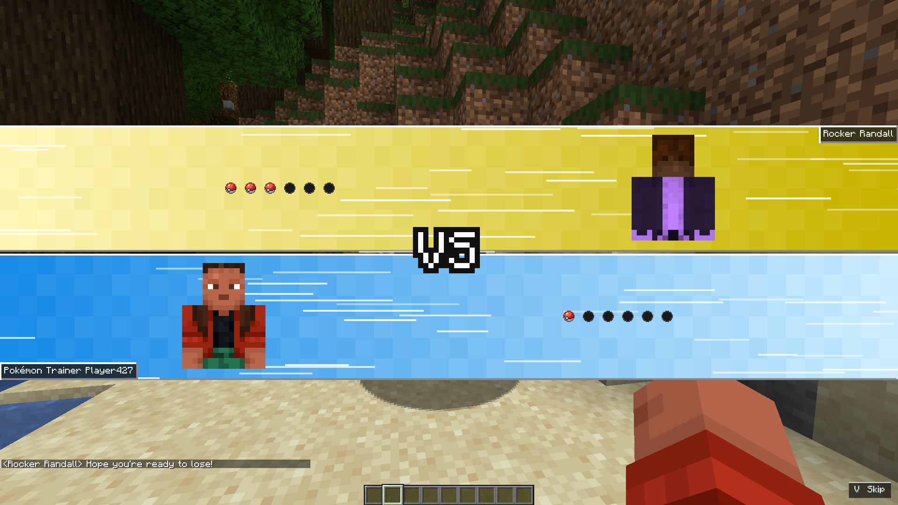
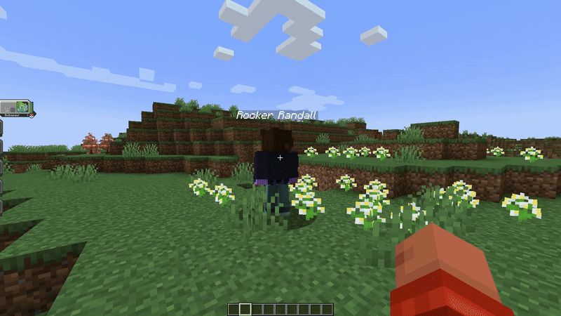

# Cobblemon Battle Slider ⚔️


*Read this in [English](#english) | Leia em [Português](#português)*

---

## English

### Overview

**Cobblemon Battle Slider** is a client-side visual addon for [Cobblemon](https://cobblemon.com/) that adds a Pokémon-inspired **VS battle introduction** before a battle begins.

The intro presents both trainers, their party Poké Balls, animated battle bars, transition effects, and staged Pokémon send-outs while preserving Cobblemon's normal battle flow.

### The problem

Cobblemon battles begin quickly and functionally, but they do not include the dramatic trainer-versus-trainer presentation commonly seen in the main Pokémon games.

For trainer battles, PvP encounters, and adventure-focused modpacks, this can make important battles feel less distinct from ordinary encounters.

### The solution

A lightweight presentation layer that temporarily delays selected client battle packets while a complete VS animation is shown.

After the animation finishes — or the player skips it — the queued battle initialization and send-out packets are replayed in a safe order:

1. Cobblemon battle model and GUI initialization
2. Opponent throw, spawn, and cry sequence
3. Player throw, spawn, and cry sequence

This keeps the visual introduction synchronized without replacing or modifying Cobblemon's core battle mechanics.

### Architecture

Single-module Fabric mod written in Kotlin, using client-side mixins and Cobblemon battle hooks.

- **Battle detection** — detects supported Cobblemon battles and resolves the local and opposing battle actors.
- **Intro state machine** — controls flicker, bar movement, VS appearance, trainer portraits, team Poké Balls, hold time, and exit animation.
- **Packet staging** — temporarily separates battle packets into core, opponent, and player queues.
- **Safe replay order** — initializes the Cobblemon battle interface before replaying Pokémon send-out effects.
- **Trainer rendering** — displays player skins and compatible trainer entities inside the animated bars.
- **Optional RCT integration** — supports trainer names, models, and trainer-type colors from Radical Cobblemon Trainers when available.
- **Vanilla controls integration** — registers the skip action in Minecraft's standard Key Binds menu.

### Key Features

- [x] **Pokémon-style VS introduction** — animated bars, flicker transition, VS emblem, trainer portraits, names, and party display.
- [x] **Six party slots per trainer** — occupied slots display each Pokémon's actual capture ball; empty slots use a custom inactive-ball texture.
- [x] **Staged Pokémon send-outs** — the opponent sends out first, followed by the local player.
- [x] **Safe skip system** — the introduction can be skipped without bypassing the normal packet-completion path.
- [x] **Vanilla keybinding support** — the default skip key is `V` and can be changed through Minecraft's normal Controls menu.
- [x] **Vanilla UI sounds** — built-in Minecraft toast sounds are used for the intro and exit transitions.
- [x] **Custom party-lineup sound** — a synchronized sound plays when the party Poké Balls appear.
- [x] **Configurable debug logging** — detailed packet and timing diagnostics can be enabled through the generated JSON config.
- [x] **Multiple GUI scales and aspect ratios** — tested on standard 16:9 displays, ultrawide layouts, and smaller windows.
- [x] **Radical Cobblemon Trainers compatibility** — optional support for RCT trainer entities and trainer-type colors.
- [x] **PvP support** — player-versus-player battles use the same VS presentation flow.

### Showcase





### Requirements

#### Required

- Minecraft `1.21.1`
- Fabric Loader `0.16.0` or newer
- Fabric API
- Fabric Language Kotlin
- Cobblemon `1.7.3`

#### Optional compatibility

- Radical Cobblemon Trainers

Radical Cobblemon Trainers is not required. When installed, Cobblemon Battle Slider can use compatible trainer entities, names, and trainer-type colors during the VS introduction.

### Installation

1. Install Fabric Loader for Minecraft `1.21.1`.
2. Install Fabric API.
3. Install Fabric Language Kotlin.
4. Install Cobblemon `1.7.3`.
5. Place the Cobblemon Battle Slider `.jar` inside the Minecraft `mods` folder.
6. Launch the game.

For RCT trainer support, install Radical Cobblemon Trainers in the same instance.

### Controls

The default skip key is:

```text
V — Skip Battle Intro
```

It can be changed through:

```text
Options
→ Controls
→ Key Binds
→ Cobblemon Battle Slider
→ Skip Battle Intro
```

No Mod Menu dependency is required.

### Configuration

On first startup, the mod creates:

```text
config/battleslider.json
```

Default configuration:

```json
{
  "debugLogging": false
}
```

Set `debugLogging` to `true` only when diagnosing battle-intro, packet-order, or skip-related problems.

Restart Minecraft after editing the file.

### Compatibility

Currently targeted versions:

| Component | Version |
|---|---|
| Minecraft | 1.21.1 |
| Fabric Loader | 0.16.0+ |
| Cobblemon | 1.7.3 |
| Java | 21 |

The mod is designed as a Cobblemon addon and does not replace or fork Cobblemon's battle system.

Dedicated-server multiplayer validation is planned. Test the mod in your own modpack before deploying it to a public server.

### Building from Source

Clone the project and run:

#### Windows

```powershell
.\gradlew.bat clean build
```

#### Linux or macOS

```bash
./gradlew clean build
```

The compiled JAR will be generated in:

```text
build/libs/
```

For release validation, test the produced JAR in a clean Minecraft instance instead of relying only on the development `runClient` environment.

### Known Limitations

- Dedicated-server multiplayer testing is not yet complete.
- Compatibility with unsupported Cobblemon versions is not guaranteed.
- Mods that replace Cobblemon's battle packet flow, battle GUI, entity spawning, or sound handling may require additional compatibility work.

### Credits

- Created by **Kaizzinho**
- Built for [Cobblemon](https://cobblemon.com/)
- Optional compatibility with Radical Cobblemon Trainers
- Uses Minecraft's built-in UI toast sounds for transition effects

### License

This project is distributed under **All Rights Reserved**.

You may download and use the mod in your own Minecraft installations and modpacks where permitted by the published distribution terms. Redistribution, modification, source reuse, or republishing is not permitted without authorization from the author.

---

## Português

### Visão geral

**Cobblemon Battle Slider** é um addon visual client-side para o [Cobblemon](https://cobblemon.com/) que adiciona uma **introdução de batalha em estilo Pokémon**, com tela VS, antes do início do combate.

A introdução apresenta os dois treinadores, as Poké Bolas das parties, barras animadas, efeitos de transição e o envio escalonado dos Pokémon, preservando o fluxo normal de batalha do Cobblemon.

### O problema

As batalhas do Cobblemon começam de forma rápida e funcional, mas não incluem a apresentação dramática de treinador contra treinador presente nos jogos principais de Pokémon.

Em batalhas contra treinadores, confrontos PvP e modpacks focados em aventura, isso pode fazer com que batalhas importantes pareçam pouco diferentes de encontros comuns.

### A solução

Uma camada visual leve que atrasa temporariamente alguns pacotes de batalha no cliente enquanto a animação VS é exibida.

Quando a animação termina — ou quando o jogador a pula — os pacotes de inicialização e envio dos Pokémon são reproduzidos em uma ordem segura:

1. Inicialização do modelo de batalha e da interface do Cobblemon
2. Sequência de arremesso, spawn e cry do oponente
3. Sequência de arremesso, spawn e cry do jogador

Isso mantém a introdução sincronizada sem substituir ou alterar as mecânicas centrais de batalha do Cobblemon.

### Arquitetura

Mod Fabric de módulo único escrito em Kotlin, utilizando mixins client-side e integrações com o sistema de batalhas do Cobblemon.

- **Detecção de batalha** — detecta batalhas compatíveis e resolve os atores local e oponente.
- **Máquina de estados da introdução** — controla flicker, movimento das barras, aparição do VS, retratos, Poké Bolas da equipe, tempo de exibição e animação de saída.
- **Fila de pacotes** — separa temporariamente os pacotes em filas de núcleo, oponente e jogador.
- **Ordem segura de reprodução** — inicializa a interface de batalha antes dos efeitos de envio dos Pokémon.
- **Renderização de treinadores** — exibe skins de jogadores e entidades de treinador compatíveis dentro das barras animadas.
- **Integração opcional com RCT** — utiliza nomes, modelos e cores de tipo dos treinadores do Radical Cobblemon Trainers quando disponível.
- **Integração com os controles vanilla** — registra a tecla de pular no menu padrão de controles do Minecraft.

### Funcionalidades principais

- [x] **Introdução VS em estilo Pokémon** — barras animadas, transição por flicker, emblema VS, retratos, nomes e exibição das parties.
- [x] **Seis slots por treinador** — slots ocupados exibem a Poké Bola real de captura de cada Pokémon; slots vazios usam uma textura inativa personalizada.
- [x] **Envio escalonado dos Pokémon** — o oponente envia seu Pokémon primeiro, seguido pelo jogador local.
- [x] **Sistema seguro de pular** — a introdução pode ser pulada sem ignorar o caminho normal de finalização dos pacotes.
- [x] **Configuração vanilla de tecla** — a tecla padrão é `V` e pode ser alterada no menu normal de controles do Minecraft.
- [x] **Sons de interface vanilla** — sons nativos de toast do Minecraft são usados nas transições de entrada e saída.
- [x] **Som personalizado da equipe** — um som sincronizado toca quando as Poké Bolas da party aparecem.
- [x] **Logs de debug configuráveis** — diagnósticos detalhados de pacotes e tempo podem ser ativados pelo arquivo JSON gerado.
- [x] **Múltiplas escalas de GUI e proporções** — testado em telas 16:9, ultrawide e janelas menores.
- [x] **Compatibilidade com Radical Cobblemon Trainers** — suporte opcional para entidades, nomes e cores de tipo dos treinadores do RCT.
- [x] **Suporte a PvP** — batalhas entre jogadores utilizam o mesmo fluxo visual de introdução VS.

### Showcase


### Requisitos

#### Obrigatórios

- Minecraft `1.21.1`
- Fabric Loader `0.16.0` ou mais recente
- Fabric API
- Fabric Language Kotlin
- Cobblemon `1.7.3`

#### Compatibilidade opcional

- Radical Cobblemon Trainers

O Radical Cobblemon Trainers não é obrigatório. Quando instalado, o Cobblemon Battle Slider pode utilizar entidades compatíveis, nomes e cores de tipo dos treinadores durante a introdução VS.

### Instalação

1. Instale o Fabric Loader para Minecraft `1.21.1`.
2. Instale a Fabric API.
3. Instale o Fabric Language Kotlin.
4. Instale o Cobblemon `1.7.3`.
5. Coloque o arquivo `.jar` do Cobblemon Battle Slider na pasta `mods`.
6. Inicie o jogo.

Para suporte aos treinadores do RCT, instale o Radical Cobblemon Trainers na mesma instância.

### Controles

A tecla padrão para pular é:

```text
V — Pular introdução da batalha
```

Ela pode ser alterada em:

```text
Opções
→ Controles
→ Teclas
→ Cobblemon Battle Slider
→ Pular introdução da batalha
```

Nenhuma dependência do Mod Menu é necessária.

### Configuração

Na primeira inicialização, o mod cria:

```text
config/battleslider.json
```

Configuração padrão:

```json
{
  "debugLogging": false
}
```

Defina `debugLogging` como `true` somente ao diagnosticar problemas relacionados à introdução, ordem dos pacotes ou sistema de pular.

Reinicie o Minecraft após editar o arquivo.

### Compatibilidade

Versões atualmente previstas:

| Componente | Versão |
|---|---|
| Minecraft | 1.21.1 |
| Fabric Loader | 0.16.0+ |
| Cobblemon | 1.7.3 |
| Java | 21 |

O mod foi projetado como um addon para o Cobblemon e não substitui nem cria um fork do sistema de batalha.

A validação multiplayer em servidor dedicado ainda está planejada. Teste o mod no seu próprio modpack antes de utilizá-lo em um servidor público.

### Compilando o projeto

Clone o projeto e execute:

#### Windows

```powershell
.\gradlew.bat clean build
```

#### Linux ou macOS

```bash
./gradlew clean build
```

O JAR compilado será gerado em:

```text
build/libs/
```

Para validar uma versão de lançamento, teste o JAR produzido em uma instância limpa do Minecraft, em vez de depender apenas do ambiente de desenvolvimento `runClient`.

### Limitações conhecidas

- Os testes multiplayer em servidor dedicado ainda não foram concluídos.
- Compatibilidade com versões não suportadas do Cobblemon não é garantida.
- Mods que substituem o fluxo de pacotes, a interface de batalha, o spawn de entidades ou o sistema de sons do Cobblemon podem exigir compatibilidade adicional.

### Créditos

- Criado por **Kaizzinho**
- Desenvolvido para o [Cobblemon](https://cobblemon.com/)
- Compatibilidade opcional com Radical Cobblemon Trainers
- Utiliza sons nativos de toast do Minecraft nos efeitos de transição

### Licença

Este projeto é distribuído sob **Todos os Direitos Reservados**.

Você pode baixar e utilizar o mod em suas próprias instalações e modpacks de Minecraft quando permitido pelos termos publicados de distribuição. Redistribuição, modificação, reutilização do código-fonte ou republicação não são permitidas sem autorização do autor.
