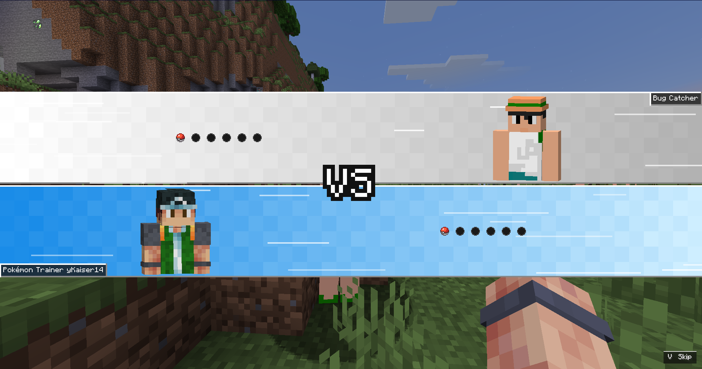
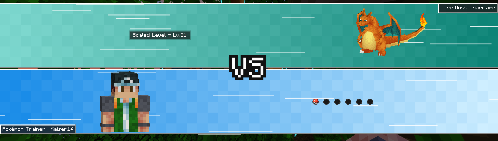
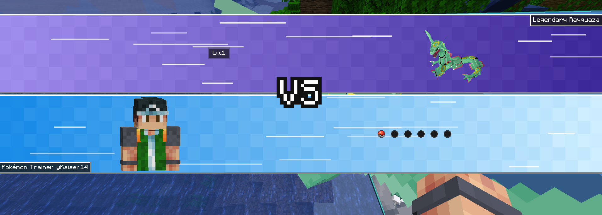
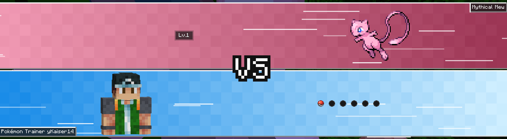
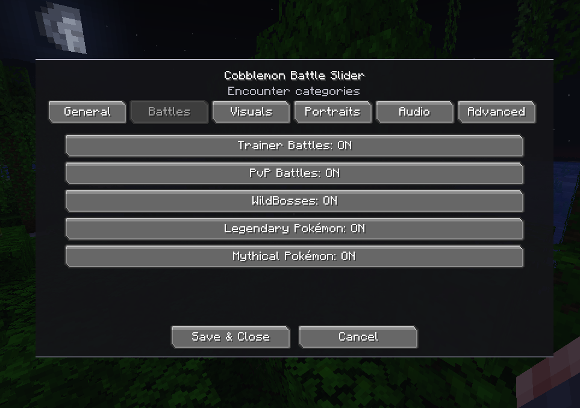

# Cobblemon Battle Introduction ⚔️


*Read this in [English](#english) | Leia em [Português](#português)*

---

## English

### Overview

**Cobblemon Battle Introduction** adds a Pokémon-inspired **VS battle introduction** to Cobblemon.

The mod presents supported encounters with animated battle bars, a VS emblem, trainer or Pokémon portraits, names, party Poké Balls, particles, transition sounds, and staged Pokémon send-outs while keeping Cobblemon's normal battle system intact.

The current version supports:

- trainer battles;
- player-versus-player battles;
- WildBosses Boss encounters;
- wild Legendary Pokémon;
- wild Mythical Pokémon.

Ordinary wild Pokémon remain untouched.

The visual presentation runs on the client. A small common-side handler also safely recalls active player-owned Pokémon before supported battles, so installing the mod on both the client and server is recommended for multiplayer.

### What it does

Battle Introduction temporarily stages selected client battle packets while the VS animation plays.

When the intro finishes, or when the player skips it, the queued actions are replayed in a controlled order:

1. Cobblemon battle model and GUI initialization;
2. opponent throw, spawn, animation, sound, and cry sequence;
3. local player send-out sequence after the configured internal stagger.

The opponent sends out first and the local player follows **2.5 seconds later**.

The VS bars retract back into the world before packet replay begins. There is no extra final full-black hold or fade.

### Battle priority

Wild encounters follow this priority:

```text
WildBosses Boss
    ↓
Legendary or Mythical
    ↓
ordinary wild battle
```

A Pokémon that is both Legendary/Mythical and an actual WildBosses Boss uses the **Boss presentation**.

This is important for modpacks that change the WildBosses species blacklist.

### Key Features

- [x] **Pokémon-style VS intro** with animated jagged bars, flicker, VS emblem, portraits, names, party display, particles, and exit animation.
- [x] **Trainer battles** with optional RCT metadata and colors.
- [x] **PvP battles** with player names, player skins, party Poké Balls, and a dedicated orange palette.
- [x] **WildBosses Boss battles** with tier colors, Boss species name, authoritative scaled level, and a real Pokémon portrait.
- [x] **Legendary and Mythical wild battles** detected from Cobblemon species labels.
- [x] **Primary-type colors** for Legendary/Mythical encounters.
- [x] **Controlled 3D trainer portraits** using upper-body player models instead of live world animation.
- [x] **Real WIDE/Steve and SLIM/Alex skin models** are preserved.
- [x] **Mirrored inward-facing trainer poses** so both sides use matching crop, camera, pitch, and opposing presentation yaw.
- [x] **2D trainer-skin fallback** when a compatible 3D player-like portrait cannot be prepared.
- [x] **Real 3D Pokémon portraits** for WildBosses and Legendary/Mythical encounters.
- [x] **Automatic Pokémon 3D fitting** based on entity width and height, with scissor clipping.
- [x] **Optional external 2D Pokémon sprite fallback** through Minecraft resource packs.
- [x] **Shiny-aware sprite lookup**.
- [x] **Opaque-bound sprite fitting** so wide or asymmetrical 2D sprites are centered and kept inside the portrait slot.
- [x] **Safe portrait failure handling** so a bad model or missing sprite never cancels the intro.
- [x] **Actual capture-ball display** for occupied party slots.
- [x] **Custom grayscale/inactive ball texture** for empty party slots.
- [x] **Safe skip system** with a remappable Minecraft keybinding.
- [x] **Raw keyboard fallback for skip input** so the battle screen cannot easily swallow the skip key.
- [x] **Vanilla UI transition sounds** using Minecraft toast sounds.
- [x] **Custom synchronized party-ball lineup sound**.
- [x] **Centered Mod Menu configuration screen** with live client settings.
- [x] **JSON configuration fallback** for users without Mod Menu.
- [x] **RCT role classifier** for Normal, Gym Leader, Elite Four, Champion, and Rival trainers.
- [x] **Cobbleverse-aware RCT progression detection** without hardcoding individual Gym Leaders.
- [x] **Exact RCT role overrides** available in JSON for unusual datapacks.
- [x] **Soft WildBosses integration** through a reflection-friendly public API.
- [x] **Soft RCT integration** through reflection.
- [x] **Optional Cobblemon Battle Extras GUI suppression compatibility** when that mod is installed.
- [x] **Temporary Pokémon world-name-tag suppression** while the VS visual is active.
- [x] **Player-only auto recall** before battle.
- [x] **Mounted Pokémon are never auto-recalled**.
- [x] **Configurable debug logging** with packet queue and timing diagnostics.
- [x] **Malformed config recovery** with a timestamped `.broken` backup.

### Animation flow

The visual state machine is:

```text
FLICKER
→ BARS_SLIDE_IN
→ VS_APPEAR
→ CHARACTERS_SLIDE_IN
→ TEAM_BALLS_SLIDE_IN
→ HOLD
→ SLIDING_OUT
→ packet replay
```

Default visual timings at **Normal** speed:

| Stage | Default |
|---|---:|
| Flicker | 2250 ms |
| Bars slide in | 1250 ms |
| VS appearance | 850 ms |
| Portraits slide in | 1250 ms |
| Party/info slide in | 650 ms |
| Hold | 1300 ms |
| Bars slide out | 1200 ms |

The global **Animation Speed** setting scales the visual stages while the hold duration remains directly configurable.

### Showcase

#### Battle introduction


#### Trainer battles



#### WildBosses



#### Legendary and Mythical encounters



#### 2D Pokémon portraits



#### In-game configuration




### Requirements

#### Required

- Minecraft `1.21.1`
- Fabric Loader `0.16.0+`
- Fabric API
- Fabric Language Kotlin
- Cobblemon `1.7.3`
- Java `21`

#### Optional integrations

- **Mod Menu `11.0.0+`** — adds the in-game configuration screen.
- **Radical Cobblemon Trainers** — adds trainer entity metadata, skins, names, trainer roles, and type colors.
- **WildBosses** — enables the dedicated Boss encounter presentation.
- **Cobblemon Battle Extras** — Battle Introduction conditionally suppresses its battle UI elements during the intro when detected.
- **Compatible Pokémon sprite resource pack** — enables external 2D Pokémon portraits and fallback rendering.

None of these are required for the base trainer/PvP presentation.

### Supported encounter types

#### Trainer battles

Standard trainer encounters use:

- opponent name badge;
- local `Pokémon Trainer <player>` badge;
- six party slots per side when enabled;
- controlled trainer portraits;
- RCT-derived colors when RCT metadata is available;
- default trainer colors otherwise.

#### PvP

Real player opponents are treated separately from NPC rivals.

PvP uses:

- real player skin;
- `Pokémon Trainer <name>` label;
- orange opponent palette;
- real party balls;
- normal staged send-out flow.

An RCT `rival` remains an NPC trainer. It is **not** treated as technical PvP.

### 3D trainer portraits

Player and compatible trainer portraits use controlled upper-body rendering.

The VS screen does not copy live sprinting, crouching, attack animation, camera movement, or leg movement.

The portrait system keeps:

- real skin texture;
- WIDE/Steve or SLIM/Alex model;
- upper body only;
- matching camera and crop;
- mirrored inward-facing poses.

Trainer portrait modes:

| Mode | Behavior |
|---|---|
| `3D Preferred` | use the controlled 3D bust and fall back to the 2D skin renderer |
| `2D Skin` | use the flat skin portrait directly |
| `Disabled` | do not render trainer/player portraits |

### WildBosses integration

When WildBosses is installed, only actual Boss battles receive the Boss presentation.

Normal wild Pokémon are not enabled by WildBosses support alone.

Example:

```text
Mythic Boss Garchomp

Scaled Level = Lv.125
```

Boss presentation includes:

- tier-colored opponent bar;
- `<Tier> Boss <Species>` label;
- scaled level from the WildBosses API when available;
- real Pokémon entity portrait;
- no opponent party-ball row;
- dark readability backdrop behind the scaled-level text;
- temporary Pokémon world-name-tag suppression.

Current Boss base colors:

| Tier | Color |
|---|---|
| Uncommon | `#3FA65A` |
| Rare | `#14B8A6` |
| Epic | `#9B59E6` |
| Legendary | `#F0A51A` |
| Mythic | `#FFFF55` |

Rare intentionally uses teal/aqua so it does not visually collide with the player's blue side.

The integration is soft. Battle Introduction loads normally without WildBosses.

WildBosses integrations should detect the Battle Introduction mod id `cobblemonbattleintroduction`. The legacy id `kaizzinhobattleslider` is temporarily provided as an alias so existing integrations continue to recognize the mod during the rebrand.

### Legendary and Mythical wild encounters

Battle Introduction also supports ordinary wild Legendary and Mythical Pokémon without requiring WildBosses.

Detection uses Cobblemon species labels:

```text
legendary
mythical
```

There is no hardcoded Articuno, Mewtwo, Mew, Suicune, and similar species list.

That means compatible datapack/custom species can participate if their Cobblemon species metadata uses the appropriate label.

The opponent label becomes:

```text
Legendary Mewtwo
```

or:

```text
Mythical Mew
```

The info row shows the Pokémon's real current level.

The opponent party-ball row is omitted for these wild encounters.

#### Primary-type palette

The special-wild opponent bar is derived from the Pokémon's current primary type:

| Type | Base color |
|---|---|
| Normal | `#A8A77A` |
| Fire | `#E7602B` |
| Water | `#285FC7` |
| Electric | `#E7BE24` |
| Grass | `#55A94F` |
| Ice | `#63C7CF` |
| Fighting | `#BE3B32` |
| Poison | `#9946A8` |
| Ground | `#C18A43` |
| Flying | `#7C74D1` |
| Psychic | `#E6507D` |
| Bug | `#93A81C` |
| Rock | `#A58D35` |
| Ghost | `#6650A1` |
| Dragon | `#5A3BE0` |
| Dark | `#574A43` |
| Steel | `#7F8CA5` |
| Fairy | `#D46EA8` |

A darker Water tone is used intentionally to stay distinct from the player's blue bar.

### Pokémon portrait pipeline

WildBosses and Legendary/Mythical encounters share the same Pokémon portrait system.

Available modes:

| Mode | Priority |
|---|---|
| `Automatic (3D → 2D)` | 3D entity → external 2D sprite → no portrait |
| `3D Only` | 3D entity → no portrait |
| `2D Preferred` | external 2D sprite → 3D entity → no portrait |
| `2D Only` | external 2D sprite → no portrait |
| `Disabled` | no Pokémon portrait |

The default is:

```text
Automatic (3D → 2D)
```

#### 3D Pokémon rendering

The actual `PokemonEntity` is rendered, preserving entity-backed appearance such as:

- species;
- form;
- shiny state;
- aspects and model state available on the entity.

Scale is normalized using both entity width and height.

This avoids maintaining a large species-specific scale table.

#### Safe 2D fallback

The optional 2D system uses Minecraft's active `ResourceManager`.

Battle Introduction does **not** need to know the resource-pack filename.

Any enabled resource pack can provide:

```text
assets/battleintroduction/textures/pokemon/front/<dex>.png
assets/battleintroduction/textures/pokemon/shiny/<dex>.png
```

For transition compatibility, existing packs that still use `assets/battleslider/...` are also detected. New packs should use the `battleintroduction` namespace.

Both naming styles are accepted:

```text
25.png
0025.png
```

Examples:

```text
assets/battleintroduction/textures/pokemon/front/0150.png
assets/battleintroduction/textures/pokemon/shiny/0150.png
```

The resolver uses:

```text
pokemon.species.nationalPokedexNumber
```

so ordinary species need no giant species-name map.

If a form or Mega fails in 3D and no form-specific system exists, the fallback resolves through the base National Dex species sprite.

The 2D renderer scans the PNG's transparent/opaque bounds once, caches the result, crops to the visible pixels, keeps the visible sprite centered, and fits it inside the portrait slot. This prevents wide wings, tails, flames, and other asymmetrical artwork from being unnecessarily clipped.

If both 3D and 2D rendering fail, the intro continues with no Pokémon portrait.

#### Sprite artwork distribution

Battle Introduction itself does not need to bundle Pokémon sprite artwork.

This allows the mod JAR to contain the rendering support while sprite artwork can be provided independently through a normal Minecraft resource pack.

Resource-pack creators are responsible for the rights and distribution terms of any artwork they include.

### Radical Cobblemon Trainers integration

RCT support is optional and reflection-based.

Battle Introduction can resolve:

- trainer entity;
- trainer ID;
- raw trainer type;
- optional flag;
- native RCT color;
- trainer role;
- region.

Recognized roles:

```text
NORMAL
GYM_LEADER
ELITE_FOUR
CHAMPION
RIVAL
```

The classifier combines:

1. exact JSON overrides;
2. standard RCT types;
3. custom regional types;
4. trainer ID patterns;
5. Cobbleverse-style regional progression rules;
6. normal fallback.

This allows regional progression datapacks to classify trainers without a giant hardcoded Gym Leader list.

Canonical role colors are used where available, with safe fallback colors for Gym Leader, Elite Four, Champion, and Rival roles.

### Party Poké Balls

Each trainer side can show up to six party slots.

Occupied slots use the Pokémon's actual capture ball when it can be resolved.

Empty slots use Battle Introduction's inactive ball texture.

The row enters with a staggered animation and a synchronized lineup sound.

WildBosses and Legendary/Mythical opponent sides replace the opponent party row with battle information.

### Auto recall

Before battle, Battle Introduction checks only `PlayerBattleActor` Pokémon.

An active player-owned Pokémon is recalled when safe.

The handler deliberately skips:

- removed entities;
- Pokémon currently carrying passengers or being used as mounts.

NPC and wild actors are not auto-recalled by this handler.

### Controls

Default key:

```text
V — Skip Battle Intro
```

Change it through:

```text
Options
→ Controls
→ Key Binds
→ Cobblemon Battle Introduction
→ Skip Battle Intro
```

The skip path is designed to work even when a battle screen consumes normal key input.

Skipping still reaches the normal packet-completion path.

### Mod Menu configuration

Mod Menu is a **soft dependency**.

When installed, Battle Introduction exposes a centered vanilla-style configuration screen through Mod Menu.

When Mod Menu is absent, Battle Introduction still loads normally and `config/battleintroduction.json` remains available.

The menu is split into:

```text
General
Battles
Visuals
Portraits
Audio
Advanced
```

#### General

| Option | Default |
|---|---|
| Enable VS Intros | On |
| Allow Intro Skip | On |
| Show Skip Prompt | On |
| Show Name Badges | On |
| Show Party Balls | On |

#### Battles

| Option | Default |
|---|---|
| Trainer Battles | On |
| PvP Battles | On |
| WildBosses | On |
| Legendary Pokémon | On |
| Mythical Pokémon | On |

#### Visuals

| Option | Values | Default |
|---|---|---|
| Animation Speed | Slow / Normal / Fast / Very Fast | Normal |
| Flash Intensity | Off / Reduced / Normal | Normal |
| VS Hold Duration | 0.25 / 0.5 / 0.8 / 1 / 1.3 / 1.6 / 2 / 2.5 s | 1.3 s |
| Bar Particles | Off / Low / Normal / High | Normal |

Animation speed multipliers:

| Speed | Multiplier |
|---|---:|
| Slow | `1.25x` |
| Normal | `1.00x` |
| Fast | `0.75x` |
| Very Fast | `0.50x` |

Particle densities use `0 / 2 / 5 / 8` particles per configured row seed.

Flash behavior:

- `Normal` uses the full default flicker sequence;
- `Reduced` uses a shorter reduced transition;
- `Off` removes the repeated black flicker.

#### Portraits

| Option | Values | Default |
|---|---|---|
| Trainer Portraits | 3D Preferred / 2D Skin / Disabled | 3D Preferred |
| Pokémon Portraits | Automatic / 3D Only / 2D Preferred / 2D Only / Disabled | Automatic |

The Portraits page also reports whether compatible 2D sprite resources are currently visible and shows the detected normal/shiny sprite counts.

#### Audio

| Option | Default |
|---|---|
| UI Transition Sounds | On |
| Party Ball Lineup Sound | On |
| Party Ball Volume | 125% |

Party-ball volume is selectable from `0%` to `200%` in `25%` steps.

#### Advanced

- Debug Logging — default `Off`;
- configured RCT override count;
- Reset Presentation Defaults.

Resetting presentation defaults intentionally preserves the advanced RCT role override map.

`Save & Close` writes the config and applies the settings to future intros immediately.

`Cancel` or `Esc` discards unsaved menu changes.

### JSON configuration

The same config backs both Mod Menu and manual JSON configuration:

```text
config/battleintroduction.json
```

Current default values:

```json
{
  "enableBattleIntros": true,
  "allowSkipping": true,
  "showSkipPrompt": true,
  "showNameBadges": true,
  "showPartyBalls": true,
  "trainerBattleIntros": true,
  "pvpBattleIntros": true,
  "wildBossBattleIntros": true,
  "legendaryBattleIntros": true,
  "mythicalBattleIntros": true,
  "animationSpeed": "normal",
  "flashIntensity": "normal",
  "holdDurationMs": 1300,
  "particleDensity": "normal",
  "trainerPortraitMode": "3d_preferred",
  "pokemonPortraitMode": "automatic",
  "uiTransitionSounds": true,
  "teamBallLineupSound": true,
  "teamBallLineupVolume": 1.25,
  "debugLogging": false,
  "rctTrainerRoleOverrides": {}
}
```

Manual JSON edits are loaded when the client starts.

The config normalizes supported enum values and clamps:

```text
holdDurationMs       250 to 2500
teamBallLineupVolume 0.0 to 2.0
```

If the JSON is malformed, Battle Introduction moves the invalid file to a timestamped `.broken` backup and recreates clean defaults.

#### RCT exact role overrides

Advanced datapacks can override a specific trainer ID:

```json
{
  "rctTrainerRoleOverrides": {
    "some_trainer_id": "elite_four"
  }
}
```

Accepted role aliases include:

```text
normal
trainer

leader
gym_leader
gymleader

e4
elite_four
elitefour
elite_4

champ
champion

rival
```

These overrides are primarily intended for unusual or inconsistent trainer datapacks.

### Source availability and usage permission

The Battle Introduction source code is publicly available for transparency, review, learning, issue diagnosis, private development, and contributions.

Public access to the source code does **not** grant automatic permission to publicly redistribute, publish, deploy, or operate Battle Introduction.

#### Permission required

**Prior written permission is required for every public modpack and every public multiplayer server using Battle Introduction.**

Prior written permission from **Kaizzinho** is also required for:

- inclusion in a public launcher, public client pack, public server pack, or other publicly distributed bundle;
- redistribution or mirroring of the official JAR outside an authorized distribution;
- public distribution of a build compiled from the source;
- public distribution or deployment of modified, forked, or derivative versions;
- commercial, monetized, sponsored, or paid public distribution or deployment.

Permission is granted per project. Approval for one modpack, server, fork, launcher, or distribution does not automatically authorize another.

#### Allowed without separate permission

You may:

- view and study the public source code;
- clone or fork the repository for inspection, learning, private development, testing, or contribution where the hosting platform allows it;
- privately modify and compile the source for personal development or testing;
- open issues and submit pull requests;
- use the official unmodified release in your own personal singleplayer installation;
- use Battle Introduction in a genuinely private, nonpublic modpack or private multiplayer server for a closed group, as long as it is not publicly advertised, publicly distributed, sold, or monetized.

A public fork or visible copy of the repository does not by itself grant permission to distribute builds or publicly deploy the mod.

If a private modpack or private server later becomes public, permission must be obtained **before** that public use begins.

See [LICENSE](LICENSE) for the complete terms.

> **Note:** because public deployment and public redistribution require authorization, Battle Introduction is source-available rather than OSI-approved open-source software.

### Installation

#### Singleplayer

1. Install Fabric Loader for Minecraft `1.21.1`.
2. Install Fabric API.
3. Install Fabric Language Kotlin.
4. Install Cobblemon `1.7.3`.
5. Place the Battle Introduction `.jar` in `mods`.
6. Launch the game.

#### Multiplayer

For the complete intended behavior, install the mod on both the client and dedicated server.

The VS rendering and configuration are client-side.

The common/server side provides the safe player Pokémon auto-recall handler.

Optional integrations should be installed according to the requirements of those mods.

### Compatibility notes

Current target:

| Component | Version |
|---|---|
| Minecraft | `1.21.1` |
| Fabric Loader | `0.16.0+` |
| Cobblemon | `1.7.3` |
| Java | `21` |
| Mod Menu | optional `11.0.0+` |

Battle Introduction does not replace or fork Cobblemon's battle system.

The client mixins temporarily suppress Cobblemon battle UI elements while the intro is active and restore normal rendering afterward.

Cobblemon Battle Extras compatibility is conditionally enabled only when that mod is detected.

Mods that heavily replace Cobblemon's battle packet flow, entity rendering, battle screens, spawning, or sound handling may require additional compatibility work.

### Building from Source

Clone the project and run:

#### Windows

```powershell
.\gradlew.bat clean build
```

#### Linux or macOS

```bash
./gradlew clean build
```

The compiled JAR is generated in:

```text
build/libs/
```

The current source includes a Mod Menu entrypoint. Mod Menu should be available to the development build as a compile/development dependency, but it must not be bundled into the released Battle Introduction JAR.

For release validation, test the built JAR in a clean instance and then in the intended modpack/server environment.

### Known Limitations

- The current release target is Minecraft `1.21.1` with Cobblemon `1.7.3`.
- Compatibility with future Cobblemon/RCT/WildBosses internals may require updates.
- Custom trainer models that are not player-like may use the 2D trainer fallback or no portrait depending on the selected mode.
- Alternate Pokémon forms currently use the real form in 3D, but the generic 2D fallback resolves by base National Dex number.
- A 2D Pokémon portrait requires a compatible external resource pack.
- Resource-pack sprite availability depends on the currently enabled Minecraft resource packs.
- Mods that replace the same Cobblemon GUI or packet paths may require additional compatibility.
- Dedicated-server validation should be completed in the target modpack before a public deployment.

### Credits

- Created by **Kaizzinho**
- Built for [Cobblemon](https://cobblemon.com/)
- Optional integration with Radical Cobblemon Trainers
- Optional integration with WildBosses
- Optional integration with Mod Menu
- Optional compatibility handling for Cobblemon Battle Extras
- Uses Minecraft's built-in UI toast sounds for transition effects

### License and usage terms

Battle Introduction is distributed under the **Battle Introduction Source-Available Permission License 1.0**.

The source code is publicly visible for learning, review, private development, and contributions.

**Prior written permission is required for every public modpack and every public multiplayer server using Battle Introduction.**

Public redistribution, public compiled builds, public modified or derivative versions, mirrors, launcher bundles, and commercial public use also require prior written permission from **Kaizzinho**.

Personal singleplayer use and genuinely private, nonpublic modpacks or servers are allowed under the conditions described in the license.

See [LICENSE](LICENSE) for the complete terms.

Pokémon, Pokémon names, and related intellectual property belong to their respective rights holders. Battle Introduction does not need to distribute Pokémon sprite artwork as part of the mod JAR; compatible sprite artwork can be supplied separately through resource packs.

---

## Português

### Visão geral

**Cobblemon Battle Introduction** adiciona ao Cobblemon uma **introdução de batalha VS inspirada em Pokémon**.

O mod apresenta encontros compatíveis com barras animadas, emblema VS, retratos de treinadores ou Pokémon, nomes, Poké Bolas das parties, partículas, sons de transição e envio escalonado dos Pokémon, mantendo o sistema normal de batalha do Cobblemon.

A versão atual suporta:

- batalhas contra treinadores;
- batalhas entre jogadores;
- encontros Boss do WildBosses;
- Pokémon Lendários selvagens;
- Pokémon Míticos selvagens.

Pokémon selvagens comuns continuam sem o slider.

A parte visual é executada no cliente. Um pequeno handler comum também recolhe com segurança Pokémon ativos pertencentes aos jogadores antes de batalhas compatíveis, portanto em multiplayer é recomendado instalar o mod tanto no cliente quanto no servidor.

### Como funciona

O Battle Introduction segura temporariamente alguns pacotes de batalha no cliente enquanto a animação VS é exibida.

Quando a introdução termina, ou quando o jogador pula a animação, as ações são reproduzidas em ordem controlada:

1. inicialização do modelo e GUI de batalha do Cobblemon;
2. sequência de arremesso, spawn, animação, som e cry do oponente;
3. sequência do jogador local após o stagger interno.

O oponente envia o Pokémon primeiro e o jogador local entra **2,5 segundos depois**.

As barras VS saem e revelam o mundo antes da reprodução dos pacotes. Não existe um hold ou fade preto extra no final.

### Prioridade de batalhas selvagens

Encontros selvagens usam esta prioridade:

```text
Boss do WildBosses
    ↓
Lendário ou Mítico
    ↓
batalha selvagem comum
```

Um Pokémon que seja Lendário/Mítico e também um Boss real do WildBosses usa a **apresentação de Boss**.

Isso é importante em modpacks que alteram a blacklist de espécies do WildBosses.

### Funcionalidades principais

- [x] **Introdução VS em estilo Pokémon** com barras serrilhadas animadas, flicker, emblema VS, retratos, nomes, party, partículas e animação de saída.
- [x] **Batalhas de treinador** com metadados e cores opcionais do RCT.
- [x] **PvP** com nomes, skins, Poké Bolas da party e paleta laranja dedicada.
- [x] **Bosses do WildBosses** com cores por tier, espécie, nível escalado e retrato real do Pokémon.
- [x] **Lendários e Míticos selvagens** detectados pelos labels de species do Cobblemon.
- [x] **Cores pelo tipo primário** em encontros Lendários/Míticos.
- [x] **Retratos 3D controlados de treinadores** usando o tronco do modelo em vez da animação ao vivo da entidade.
- [x] **Modelos reais WIDE/Steve e SLIM/Alex** preservados.
- [x] **Poses espelhadas olhando para dentro** com crop, câmera, pitch e yaw de apresentação correspondentes.
- [x] **Fallback 2D de skin** quando um retrato 3D player-like não pode ser preparado.
- [x] **Retratos 3D reais de Pokémon** para WildBosses e Lendários/Míticos.
- [x] **Ajuste automático de escala 3D** usando largura e altura da entidade.
- [x] **Fallback opcional para sprites 2D externos** via resource pack do Minecraft.
- [x] **Busca de sprite considerando shiny**.
- [x] **Ajuste pelos pixels visíveis do sprite** para manter sprites largos ou assimétricos dentro do slot.
- [x] **Falha segura de retratos** para um modelo ou sprite ruim nunca cancelar a intro.
- [x] **Poké Bola real de captura** nos slots ocupados.
- [x] **Textura inativa personalizada** nos slots vazios.
- [x] **Sistema seguro de skip** com keybind remapeável.
- [x] **Fallback de input bruto do teclado** para o skip continuar funcionando quando uma tela de batalha consome a tecla.
- [x] **Sons vanilla de transição** usando sons de toast do Minecraft.
- [x] **Som sincronizado da entrada das Poké Bolas**.
- [x] **Tela centralizada de configuração pelo Mod Menu**.
- [x] **Configuração JSON** para quem não usa Mod Menu.
- [x] **Classificador RCT** para Normal, Gym Leader, Elite Four, Champion e Rival.
- [x] **Detecção de progressão RCT compatível com Cobbleverse** sem hardcode individual de Gym Leaders.
- [x] **Overrides exatos de roles do RCT** disponíveis no JSON.
- [x] **Integração soft com WildBosses** pela API pública reflection-friendly.
- [x] **Integração soft com RCT** via reflection.
- [x] **Compatibilidade opcional com Cobblemon Battle Extras** para esconder a UI dele durante a intro.
- [x] **Supressão temporária da name tag do Pokémon no mundo** enquanto o VS está ativo.
- [x] **Auto recall somente para Pokémon de jogadores**.
- [x] **Pokémon montados nunca são recolhidos automaticamente**.
- [x] **Debug configurável** com diagnóstico de filas e timings.
- [x] **Recuperação de config quebrada** com backup `.broken` contendo timestamp.

### Fluxo da animação

A máquina de estados visual é:

```text
FLICKER
→ BARS_SLIDE_IN
→ VS_APPEAR
→ CHARACTERS_SLIDE_IN
→ TEAM_BALLS_SLIDE_IN
→ HOLD
→ SLIDING_OUT
→ reprodução dos pacotes
```

Tempos visuais padrão em velocidade **Normal**:

| Etapa | Padrão |
|---|---:|
| Flicker | 2250 ms |
| Entrada das barras | 1250 ms |
| Aparição do VS | 850 ms |
| Entrada dos retratos | 1250 ms |
| Entrada da party/info | 650 ms |
| Hold | 1300 ms |
| Saída das barras | 1200 ms |

A opção **Velocidade da animação** escala os estágios visuais enquanto o tempo de hold pode ser configurado diretamente.

### Showcase

#### Demo completa


#### Batalha contra treinadores RCT


#### Integração com WildBosses


#### Encontros de pokémon lendário/mítico


#### Sprites 2D


#### Integração com ModMenu


### Requisitos

#### Obrigatórios

- Minecraft `1.21.1`
- Fabric Loader `0.16.0+`
- Fabric API
- Fabric Language Kotlin
- Cobblemon `1.7.3`
- Java `21`

#### Integrações opcionais

- **Mod Menu `11.0.0+`** — adiciona a tela de configuração dentro do jogo.
- **Radical Cobblemon Trainers** — fornece metadados, skins, nomes, roles e cores dos treinadores.
- **WildBosses** — ativa a apresentação dedicada de Boss.
- **Cobblemon Battle Extras** — o Battle Introduction esconde condicionalmente seus elementos durante a intro quando o mod é detectado.
- **Resource pack compatível de sprites de Pokémon** — habilita retratos 2D externos e fallback.

Nenhuma dessas integrações é necessária para a apresentação base de treinador/PvP.

### Tipos de encontro

#### Batalhas de treinador

Encontros normais contra treinadores usam:

- badge com nome do oponente;
- badge local `Pokémon Trainer <player>`;
- até seis slots de party por lado quando habilitados;
- retratos controlados;
- cores derivadas do RCT quando disponíveis;
- cores padrão de treinador como fallback.

#### PvP

Oponentes jogadores reais são tratados separadamente de rivals NPC.

PvP usa:

- skin real do jogador;
- label `Pokémon Trainer <nome>`;
- paleta laranja;
- Poké Bolas reais da party;
- fluxo normal de envio escalonado.

Um `rival` do RCT continua sendo um treinador NPC. Ele **não** vira PvP técnico.

### Retratos 3D de treinadores

Jogador e treinadores compatíveis usam renderização controlada do tronco.

A tela VS não copia corrida, agachamento, ataque, movimento de câmera ou movimento das pernas da entidade no mundo.

O sistema mantém:

- textura real da skin;
- modelo WIDE/Steve ou SLIM/Alex;
- apenas a parte superior do corpo;
- câmera e crop correspondentes;
- poses espelhadas olhando para dentro.

Modos de retrato:

| Modo | Comportamento |
|---|---|
| `3D Preferred` | usa o busto 3D e cai para o renderer 2D de skin se necessário |
| `2D Skin` | força o retrato plano da skin |
| `Disabled` | não renderiza retrato de treinador/jogador |

### Integração com WildBosses

Com o WildBosses instalado, apenas batalhas contra Bosses reais recebem a apresentação de Boss.

Pokémon selvagens comuns não passam a usar o slider apenas por causa dessa integração.

Exemplo:

```text
Mythic Boss Garchomp

Scaled Level = Lv.125
```

A apresentação inclui:

- barra do oponente colorida pelo tier;
- label `<Tier> Boss <Espécie>`;
- nível escalado retornado pela API do WildBosses quando disponível;
- retrato da entidade real do Pokémon;
- nenhuma linha de Poké Bolas no lado do Boss;
- fundo escuro de leitura atrás do texto de nível;
- supressão temporária da name tag do Pokémon no mundo.

Cores base atuais:

| Tier | Cor |
|---|---|
| Uncommon | `#3FA65A` |
| Rare | `#14B8A6` |
| Epic | `#9B59E6` |
| Legendary | `#F0A51A` |
| Mythic | `#FFFF55` |

Rare usa teal/aqua de propósito para não se confundir com o azul do jogador.

A integração é soft. O Battle Introduction inicia normalmente sem o WildBosses.

Integrações com WildBosses devem detectar o mod id `cobblemonbattleintroduction`. O id antigo `kaizzinhobattleslider` é fornecido temporariamente como alias para manter integrações existentes funcionando durante o rebrand.

### Encontros Lendários e Míticos

Battle Introduction também suporta Pokémon Lendários e Míticos selvagens comuns sem exigir WildBosses.

A detecção usa os labels das species do Cobblemon:

```text
legendary
mythical
```

Não existe uma lista hardcoded de Articuno, Mewtwo, Mew, Suicune e semelhantes.

Isso permite que species compatíveis de datapacks usem o mesmo sistema quando os metadados do Cobblemon tiverem o label adequado.

O lado do oponente mostra:

```text
Legendary Mewtwo
```

ou:

```text
Mythical Mew
```

A linha de informação mostra o nível atual real do Pokémon.

A linha de Poké Bolas do oponente não aparece nesses encontros selvagens.

#### Paleta pelo tipo primário

A barra especial usa o tipo primário atual do Pokémon:

| Tipo | Cor base |
|---|---|
| Normal | `#A8A77A` |
| Fire | `#E7602B` |
| Water | `#285FC7` |
| Electric | `#E7BE24` |
| Grass | `#55A94F` |
| Ice | `#63C7CF` |
| Fighting | `#BE3B32` |
| Poison | `#9946A8` |
| Ground | `#C18A43` |
| Flying | `#7C74D1` |
| Psychic | `#E6507D` |
| Bug | `#93A81C` |
| Rock | `#A58D35` |
| Ghost | `#6650A1` |
| Dragon | `#5A3BE0` |
| Dark | `#574A43` |
| Steel | `#7F8CA5` |
| Fairy | `#D46EA8` |

Water usa um azul mais escuro para ficar visualmente separado da barra azul do jogador.

### Pipeline de retrato dos Pokémon

WildBosses e Lendários/Míticos compartilham o mesmo sistema.

Modos disponíveis:

| Modo | Prioridade |
|---|---|
| `Automatic (3D → 2D)` | entidade 3D → sprite 2D externo → sem retrato |
| `3D Only` | entidade 3D → sem retrato |
| `2D Preferred` | sprite 2D externo → entidade 3D → sem retrato |
| `2D Only` | sprite 2D externo → sem retrato |
| `Disabled` | sem retrato |

O padrão é:

```text
Automatic (3D → 2D)
```

#### Renderização 3D

A `PokemonEntity` real é renderizada, preservando dados visuais vinculados à entidade, como:

- species;
- forma;
- shiny;
- aspects e estado do modelo disponíveis na entidade.

A escala é normalizada com largura e altura da entidade.

Isso evita uma tabela manual enorme por species.

#### Fallback 2D

O sistema 2D usa o `ResourceManager` ativo do Minecraft.

O Battle Introduction não precisa saber o nome do resource pack.

Qualquer pack habilitado pode fornecer:

```text
assets/battleintroduction/textures/pokemon/front/<dex>.png
assets/battleintroduction/textures/pokemon/shiny/<dex>.png
```

Os dois padrões de nome são aceitos:

```text
25.png
0025.png
```

Exemplos:

```text
assets/battleintroduction/textures/pokemon/front/0150.png
assets/battleintroduction/textures/pokemon/shiny/0150.png
```

A resolução usa:

```text
pokemon.species.nationalPokedexNumber
```

então Pokémon comuns não precisam de um mapa gigante de nomes.

Se uma forma ou Mega falhar no 3D e não houver um resolver específico de forma, o fallback usa o sprite da espécie base pelo National Dex.

O renderer 2D lê os limites transparentes/opacos do PNG uma vez, mantém o resultado em cache, recorta os pixels visíveis, centraliza o conteúdo e ajusta tudo dentro do slot. Isso evita clipping desnecessário em asas, caudas, chamas e sprites assimétricos.

Se 3D e 2D falharem, a intro continua sem retrato.

#### Distribuição dos sprites

O Battle Introduction não precisa incluir artwork de Pokémon dentro do JAR.

O mod pode distribuir apenas o suporte de renderização enquanto os sprites são fornecidos separadamente por um resource pack normal.

Quem cria ou distribui o resource pack é responsável pelos direitos e termos de uso das imagens incluídas.

### Integração com Radical Cobblemon Trainers

O suporte ao RCT é opcional e reflection-based.

O Battle Introduction pode resolver:

- entidade do treinador;
- trainer ID;
- tipo bruto;
- flag optional;
- cor nativa do tipo;
- role;
- região.

Roles reconhecidas:

```text
NORMAL
GYM_LEADER
ELITE_FOUR
CHAMPION
RIVAL
```

A classificação combina:

1. overrides exatos do JSON;
2. tipos padrão do RCT;
3. tipos regionais customizados;
4. padrões do trainer ID;
5. regras de progressão regional no estilo Cobbleverse;
6. fallback normal.

Isso permite classificar progressões regionais sem uma lista hardcoded enorme de Gym Leaders.

### Poké Bolas da party

Cada lado pode mostrar até seis slots.

Slots ocupados usam a Poké Bola real de captura quando ela pode ser resolvida.

Slots vazios usam a textura inativa do Battle Introduction.

A linha entra com animação staggered e som sincronizado.

Bosses e Lendários/Míticos substituem a linha do oponente por informações do encontro.

### Auto recall

Antes da batalha, o Battle Introduction verifica apenas `PlayerBattleActor`.

Um Pokémon ativo pertencente ao jogador é recolhido quando seguro.

O handler ignora:

- entidades já removidas;
- Pokémon carregando passageiros ou usados como mount.

NPCs e atores selvagens não são recolhidos por esse handler.

### Controles

Tecla padrão:

```text
V — Pular introdução da batalha
```

Altere em:

```text
Opções
→ Controles
→ Teclas
→ Cobblemon Battle Introduction
→ Pular introdução da batalha
```

O caminho de skip foi feito para continuar funcionando mesmo quando uma tela de batalha consome o input normal.

Pular a intro ainda usa o fluxo normal de conclusão dos pacotes.

### Configuração pelo Mod Menu

Mod Menu é uma **soft dependency**.

Quando instalado, o Battle Introduction disponibiliza uma tela centralizada usando widgets vanilla.

Sem Mod Menu, o Battle Introduction continua funcionando normalmente e `config/battleintroduction.json` permanece disponível.

A tela é dividida em:

```text
General
Battles
Visuals
Portraits
Audio
Advanced
```

#### General

| Opção | Padrão |
|---|---|
| Enable VS Intros | On |
| Allow Intro Skip | On |
| Show Skip Prompt | On |
| Show Name Badges | On |
| Show Party Balls | On |

#### Battles

| Opção | Padrão |
|---|---|
| Trainer Battles | On |
| PvP Battles | On |
| WildBosses | On |
| Legendary Pokémon | On |
| Mythical Pokémon | On |

#### Visuals

| Opção | Valores | Padrão |
|---|---|---|
| Animation Speed | Slow / Normal / Fast / Very Fast | Normal |
| Flash Intensity | Off / Reduced / Normal | Normal |
| VS Hold Duration | 0.25 / 0.5 / 0.8 / 1 / 1.3 / 1.6 / 2 / 2.5 s | 1.3 s |
| Bar Particles | Off / Low / Normal / High | Normal |

Multiplicadores:

| Velocidade | Multiplicador |
|---|---:|
| Slow | `1.25x` |
| Normal | `1.00x` |
| Fast | `0.75x` |
| Very Fast | `0.50x` |

Densidade de partículas usa `0 / 2 / 5 / 8` partículas por row configurada.

#### Portraits

| Opção | Valores | Padrão |
|---|---|---|
| Trainer Portraits | 3D Preferred / 2D Skin / Disabled | 3D Preferred |
| Pokémon Portraits | Automatic / 3D Only / 2D Preferred / 2D Only / Disabled | Automatic |

A página também informa se sprites 2D compatíveis foram encontrados e mostra as quantidades normal/shiny disponíveis nos resource packs ativos.

#### Audio

| Opção | Padrão |
|---|---|
| UI Transition Sounds | On |
| Party Ball Lineup Sound | On |
| Party Ball Volume | 125% |

O volume pode ser escolhido de `0%` a `200%` em passos de `25%`.

#### Advanced

- Debug Logging — padrão `Off`;
- quantidade de overrides RCT configurados;
- Reset Presentation Defaults.

O reset de apresentação preserva de propósito o mapa avançado de overrides do RCT.

`Save & Close` grava o JSON e aplica as mudanças nas próximas intros imediatamente.

`Cancel` ou `Esc` descarta mudanças não salvas.

### Configuração JSON

O Mod Menu e a configuração manual usam o mesmo arquivo:

```text
config/battleintroduction.json
```

Valores padrão atuais:

```json
{
  "enableBattleIntros": true,
  "allowSkipping": true,
  "showSkipPrompt": true,
  "showNameBadges": true,
  "showPartyBalls": true,
  "trainerBattleIntros": true,
  "pvpBattleIntros": true,
  "wildBossBattleIntros": true,
  "legendaryBattleIntros": true,
  "mythicalBattleIntros": true,
  "animationSpeed": "normal",
  "flashIntensity": "normal",
  "holdDurationMs": 1300,
  "particleDensity": "normal",
  "trainerPortraitMode": "3d_preferred",
  "pokemonPortraitMode": "automatic",
  "uiTransitionSounds": true,
  "teamBallLineupSound": true,
  "teamBallLineupVolume": 1.25,
  "debugLogging": false,
  "rctTrainerRoleOverrides": {}
}
```

Edições manuais no JSON são carregadas quando o cliente inicia.

O config normaliza enums e limita:

```text
holdDurationMs       250 até 2500
teamBallLineupVolume 0.0 até 2.0
```

Se o JSON estiver inválido, o Battle Introduction move o arquivo quebrado para um backup `.broken` com timestamp e recria os padrões.

#### Overrides exatos do RCT

Datapacks avançados podem sobrescrever a role de um trainer ID específico:

```json
{
  "rctTrainerRoleOverrides": {
    "some_trainer_id": "elite_four"
  }
}
```

Aliases aceitos:

```text
normal
trainer

leader
gym_leader
gymleader

e4
elite_four
elitefour
elite_4

champ
champion

rival
```

### Disponibilidade do código e permissão de uso

O código-fonte do Battle Introduction fica disponível publicamente para transparência, análise, aprendizado, diagnóstico de problemas, desenvolvimento privado e contribuições.

Ter acesso público ao código **não** concede automaticamente permissão para redistribuir, publicar, disponibilizar ou operar o Battle Introduction publicamente.

#### Permissão obrigatória

**É necessária autorização prévia por escrito para todo modpack público e todo servidor multiplayer público que utilizar o Battle Introduction.**

Também é necessária autorização prévia de **Kaizzinho** para:

- inclusão em launcher público, client pack público, server pack público ou outro pacote distribuído publicamente;
- redistribuição ou mirror do JAR oficial fora de uma distribuição autorizada;
- distribuição pública de builds compiladas a partir do código-fonte;
- distribuição ou uso público de versões modificadas, forks ou trabalhos derivados;
- distribuição ou uso público comercial, monetizado, patrocinado ou pago.

A permissão é concedida por projeto. A autorização para um modpack, servidor, fork, launcher ou distribuição não autoriza automaticamente outro.

#### Permitido sem autorização separada

Você pode:

- visualizar e estudar o código-fonte público;
- clonar ou criar fork do repositório para análise, aprendizado, desenvolvimento privado, testes ou contribuição quando a plataforma permitir;
- modificar e compilar o código de forma privada para desenvolvimento ou testes pessoais;
- abrir issues e enviar pull requests;
- usar a versão oficial sem modificações em sua própria instalação singleplayer pessoal;
- usar o Battle Introduction em um modpack realmente privado ou servidor multiplayer privado para um grupo fechado, desde que não seja anunciado publicamente, distribuído publicamente, vendido ou monetizado.

Um fork público ou uma cópia visível do repositório não concede por si só permissão para distribuir builds ou disponibilizar o mod publicamente.

Se um modpack ou servidor privado se tornar público depois, a autorização deve ser obtida **antes** do início desse uso público.

Consulte [LICENSE](LICENSE) para os termos completos.

> **Nota:** como a distribuição e o uso público exigem autorização, o Battle Introduction é um projeto de código-fonte disponível e não software open source aprovado pela OSI.

### Instalação

#### Singleplayer

1. Instale Fabric Loader para Minecraft `1.21.1`.
2. Instale Fabric API.
3. Instale Fabric Language Kotlin.
4. Instale Cobblemon `1.7.3`.
5. Coloque o `.jar` do Battle Introduction em `mods`.
6. Inicie o jogo.

#### Multiplayer

Para o comportamento completo, instale o mod no cliente e no servidor dedicado.

A renderização VS e as configurações são client-side.

O lado comum/servidor fornece o handler seguro de auto recall dos Pokémon do jogador.

Integrações opcionais devem ser instaladas de acordo com os requisitos dos respectivos mods.

### Compatibilidade

Target atual:

| Componente | Versão |
|---|---|
| Minecraft | `1.21.1` |
| Fabric Loader | `0.16.0+` |
| Cobblemon | `1.7.3` |
| Java | `21` |
| Mod Menu | opcional `11.0.0+` |

O Battle Introduction não substitui nem cria um fork do sistema de batalha do Cobblemon.

Os mixins client-side escondem temporariamente elementos da UI de batalha enquanto a intro está ativa e restauram a renderização normal depois.

A compatibilidade com Cobblemon Battle Extras é carregada condicionalmente apenas quando o mod é detectado.

Mods que substituem fortemente os mesmos pacotes, telas, renderização de entidades, spawn ou sons do Cobblemon podem exigir compatibilidade adicional.

### Compilando o projeto

Clone o projeto e execute:

#### Windows

```powershell
.\gradlew.bat clean build
```

#### Linux ou macOS

```bash
./gradlew clean build
```

O JAR compilado será gerado em:

```text
build/libs/
```

O código atual possui um entrypoint do Mod Menu. O Mod Menu deve estar disponível como dependência de compile/desenvolvimento, mas não deve ser incluído dentro do JAR final do Battle Introduction.

Para validar uma release, teste o JAR em uma instância limpa e depois no modpack/servidor alvo.

### Limitações conhecidas

- O target atual é Minecraft `1.21.1` com Cobblemon `1.7.3`.
- Atualizações futuras do Cobblemon, RCT ou WildBosses podem exigir ajustes.
- Modelos customizados de NPC que não sejam player-like podem usar fallback 2D ou nenhum retrato conforme a opção escolhida.
- Formas alternativas usam a forma real no 3D, mas o fallback 2D genérico resolve pela espécie base do National Dex.
- Retratos 2D de Pokémon exigem um resource pack externo compatível.
- A disponibilidade de sprites depende dos resource packs atualmente habilitados.
- Mods que substituam os mesmos caminhos de GUI ou pacotes podem exigir compatibilidade.
- A validação em servidor dedicado deve ser concluída no modpack alvo antes de um deploy público.

### Créditos

- Criado por **Kaizzinho**
- Desenvolvido para [Cobblemon](https://cobblemon.com/)
- Integração opcional com Radical Cobblemon Trainers
- Integração opcional com WildBosses
- Integração opcional com Mod Menu
- Compatibilidade opcional com Cobblemon Battle Extras
- Usa sons vanilla de toast do Minecraft nas transições

### Licença e termos de uso

O Battle Introduction é distribuído sob a **Battle Introduction Source-Available Permission License 1.0**.

O código-fonte fica visível publicamente para aprendizado, análise, desenvolvimento privado e contribuições.

**É necessária autorização prévia por escrito para todo modpack público e todo servidor multiplayer público que utilizar o Battle Introduction.**

Redistribuição pública, builds públicas compiladas a partir do código, versões modificadas ou derivadas públicas, mirrors, pacotes de launcher e uso público comercial também exigem autorização prévia de **Kaizzinho**.

Uso pessoal em singleplayer e modpacks ou servidores realmente privados e não públicos são permitidos nas condições descritas na licença.

Consulte [LICENSE](LICENSE) para os termos completos.

Pokémon, nomes de Pokémon e propriedades relacionadas pertencem aos seus respectivos detentores. O Battle Introduction não precisa distribuir sprites de Pokémon dentro do JAR; artwork compatível pode ser fornecida separadamente por resource packs.
