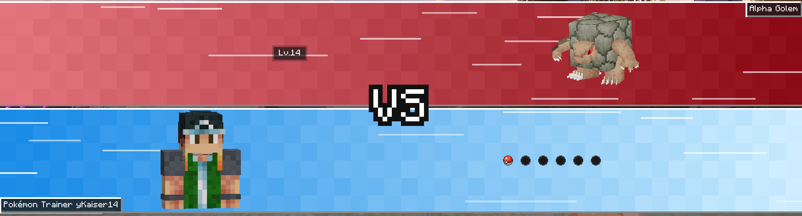
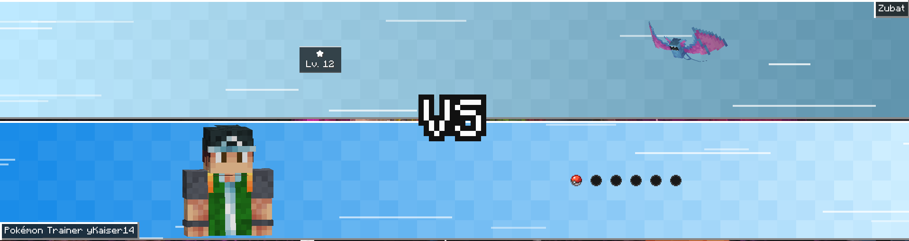

# Cobblemon Battle Introduction ⚔️


*Read this in [English](#english) | Leia em [Português](#português)*

---

## English

### Overview

**Cobblemon Battle Introduction** adds a Pokémon-inspired **VS battle introduction** to Cobblemon.

The mod presents supported encounters with animated battle bars, a VS emblem, trainer or Pokémon portraits, names, party Poké Balls, particles, transition sounds, and staged Pokémon send-outs while keeping Cobblemon's normal battle system intact.

The current version supports:

- trainer battles;
- player-versus-player battles;
- WildBosses Boss encounters;
- Cobblemon Raid Dens battles;
- wild Legendary Pokémon;
- wild Mythical Pokémon;
- Alpha Pokémon.

Ordinary wild Pokémon remain untouched.

The visual presentation runs on the client. On servers that also have Battle Introduction installed, a small optional server bridge sends an authoritative encounter descriptor to modded clients before the battle presentation begins. The server only sends this payload to clients that advertise Battle Introduction support, so players without the mod can join and battle normally. A client with Battle Introduction can also use a packet-based fallback on servers that do not have the mod installed, including public servers.

### What it does

Battle Introduction temporarily stages selected client battle packets while the VS animation plays.

When the intro finishes, or when the player skips it, the queued actions are replayed in a controlled order:

1. Cobblemon battle model and GUI initialization;
2. opponent throw, spawn, animation, sound, and cry sequence;
3. local player send-out sequence after the configured internal stagger.

The opponent sends out first and the local player follows **2.5 seconds later**.

The VS bars retract back into the world before packet replay begins. There is no extra final full-black hold or fade.

### Battle priority

Wild encounters follow this priority:

```text
Cobblemon Raid Dens
    ↓
WildBosses Boss
    ↓
Legendary or Mythical
    ↓
Alpha Pokémon
    ↓
ordinary wild battle
```

A raid encounter always uses the **Raid Dens presentation**. Outside raids, a Pokémon that is both Legendary/Mythical and an actual WildBosses Boss uses the **Boss presentation**. Legendary/Mythical classification stays above Alpha, so an Alpha Legendary or Mythical keeps the Legendary/Mythical presentation rather than being downgraded to the generic Alpha presentation.

This is important for modpacks that change the WildBosses species blacklist.

### Key Features

- [x] **Pokémon-style VS intro** with animated jagged bars, flicker, VS emblem, portraits, names, party display, particles, and exit animation.
- [x] **Trainer battles** with optional RCT metadata and colors.
- [x] **PvP battles** with player names, player skins, party Poké Balls, and a dedicated orange palette.
- [x] **WildBosses Boss battles** with tier colors, Boss species name, authoritative scaled level, and a real Pokémon portrait.
- [x] **Cobblemon Raid Dens battles** with native raid-type colors, star rating, level, real Pokémon portrait, and per-client presentation.
- [x] **Legendary and Mythical wild battles** detected from Cobblemon species labels.
- [x] **Alpha Pokémon battles** detected from Cobblemon 1.8's synchronized `Pokemon.isAlpha` state.
- [x] **Primary-type colors** for Legendary/Mythical encounters and a fixed **Lava Red `#CF1020`** palette for Alpha encounters.
- [x] **Controlled 3D trainer portraits** using upper-body player models instead of live world animation.
- [x] **Real WIDE/Steve and SLIM/Alex skin models** are preserved.
- [x] **Mirrored inward-facing trainer poses** so both sides use matching crop, camera, pitch, and opposing presentation yaw.
- [x] **2D trainer-skin fallback** when a compatible 3D player-like portrait cannot be prepared.
- [x] **Real 3D Pokémon portraits** for WildBosses, Legendary/Mythical, and Alpha encounters.
- [x] **Automatic Pokémon 3D fitting** based on entity width and height, with scissor clipping.
- [x] **Optional external 2D Pokémon sprite fallback** through Minecraft resource packs.
- [x] **Shiny-aware sprite lookup**.
- [x] **Opaque-bound sprite fitting** so wide or asymmetrical 2D sprites are centered and kept inside the portrait slot.
- [x] **Safe portrait failure handling** so a bad model or missing sprite never cancels the intro.
- [x] **Actual capture-ball display** for occupied party slots.
- [x] **Custom grayscale/inactive ball texture** for empty party slots.
- [x] **Safe skip system** with a remappable Minecraft keybinding.
- [x] **Raw keyboard fallback for skip input** so the battle screen cannot easily swallow the skip key.
- [x] **Vanilla UI transition sounds** using Minecraft toast sounds.
- [x] **Custom synchronized party-ball lineup sound**.
- [x] **Centered Mod Menu configuration screen** with live client settings.
- [x] **JSON configuration fallback** for users without Mod Menu.
- [x] **RCT role classifier** for Normal, Gym Leader, Elite Four, Champion, and Rival trainers.
- [x] **Cobbleverse-aware RCT progression detection** without hardcoding individual Gym Leaders.
- [x] **Exact RCT role overrides** available in JSON for unusual datapacks.
- [x] **Soft WildBosses integration** through a reflection-friendly public API.
- [x] **Soft Cobblemon Raid Dens integration** through reflection.
- [x] **Soft RCT integration** through reflection.
- [x] **Optional Cobblemon Battle Extras GUI suppression compatibility** when that mod is installed.
- [x] **Temporary Pokémon world-name-tag suppression** while the VS visual is active.
- [x] **Player-only auto recall** before battle.
- [x] **Mounted Pokémon are never auto-recalled**.
- [x] **Configurable debug logging** with packet queue and timing diagnostics.
- [x] **Malformed config recovery** with a timestamped `.broken` backup.

### Animation flow

The visual state machine is:

```text
FLICKER
→ BARS_SLIDE_IN
→ VS_APPEAR
→ CHARACTERS_SLIDE_IN
→ TEAM_BALLS_SLIDE_IN
→ HOLD
→ SLIDING_OUT
→ packet replay
```

Default visual timings at **Normal** speed:

| Stage | Default |
|---|---:|
| Flicker | 2250 ms |
| Bars slide in | 1250 ms |
| VS appearance | 850 ms |
| Portraits slide in | 1250 ms |
| Party/info slide in | 650 ms |
| Hold | 1300 ms |
| Bars slide out | 1200 ms |

The global **Animation Speed** setting scales the visual stages while the hold duration remains directly configurable.

### Showcase

#### Battle introduction


#### Trainer battles


#### Alpha encounters


#### Legendary and Mythical encounters


#### 2D Pokémon portraits


#### In-game configuration with ModMenu


#### WildBosses


#### Cobblemon Raid Dens




### Requirements

#### Required

- Minecraft `1.21.1`
- Fabric Loader `0.17.2+`
- Fabric API
- Fabric Language Kotlin
- Cobblemon `1.8.1`
- Java `21`

#### Optional integrations

- **Mod Menu `11.0.0+`** — adds the in-game configuration screen.
- **Radical Cobblemon Trainers `0.19.0-beta+` + RCT API `0.16.0-beta+`** — adds trainer entity metadata, skins, names, trainer roles, party occupancy, and type colors. This is the Cobblemon 1.8-compatible RCT stack used by the development build.
- **WildBosses** — enables the dedicated Boss encounter presentation.
- **Cobblemon Raid Dens** — enables the dedicated raid presentation. Raid intros are local to each modded client, so unmodded players can participate in the same raid normally.
- **Cobblemon Battle Extras** — Battle Introduction conditionally suppresses its battle UI elements during the intro when detected.
- **Compatible Pokémon sprite resource pack** — enables external 2D Pokémon portraits and fallback rendering.

None of these are required for the base trainer/PvP presentation.

### Cobblemon 1.8 compatibility

This source targets **Cobblemon 1.8.x on Minecraft 1.21.1**. The battle event, actor, party-storage, caught-ball, Pokémon entity spawn-direction, and core battle packet surfaces used by Battle Introduction were audited for the 1.8 port.

Cobblemon 1.8 Alpha Pokémon receive a dedicated Alpha introduction. Detection uses Cobblemon's synchronized `Pokemon.isAlpha` state, so it works in the authoritative server path and in the client-only fallback without species lists or heuristics. Alpha encounters use a fixed **Lava Red `#CF1020`** opponent palette, matching their red eye glare, show `Alpha <Species>`, show the real current level, and use the normal Pokémon portrait path.

Alpha is intentionally below Raid Dens, WildBosses, and Legendary/Mythical in encounter priority.

Cobblemon 1.8 also adds intrinsic Pokémon size variation and Alpha/baby scaling. The 3D portrait path continues to use the real Pokémon/entity data, but very small, very large, intrinsically scaled, and Alpha-sized Pokémon should be included in release regression testing.

### Recommended immersion setup

For the best overall experience, I **highly recommend using Cobblemon Battle Introduction together with CobbleTunes and adapted resource packs for both mods**.

For CobbleTunes, use a resource pack that provides the appropriate `.ogg` battle music files so the encounter can start with matching Pokémon-style music. For Battle Introduction, use a compatible resource pack that provides matching 2D Pokémon portraits and other presentation assets. Used together, the music, portraits, and VS animation make the transition feel much closer to a complete Pokémon-style battle introduction instead of a standalone visual effect.

These are still optional and Battle Introduction works without them.


### Cobblemon Raid Dens integration

When Cobblemon Raid Dens is installed, raid battles receive a dedicated Pokémon-style introduction before the local battle packets are released.

Raid encounters have the highest wild-battle presentation priority:

```text
Cobblemon Raid Dens
    ↓
WildBosses Boss
    ↓
Legendary or Mythical
    ↓
Alpha Pokémon
    ↓
ordinary wild battle
```

The opponent keeps its species name in the normal top-right name badge. The raid information block replaces the opponent party row and shows the native raid star rating together with the boss level:

```text
★★★★★
Lv. 75
```

The top bar color is taken from the Raid Dens raid type when available.

Raid introductions use the normal **Allow Intro Skip** setting. If skipping is enabled, the player can skip the raid intro through the same safe packet-flush path used by other supported encounters.

Raid intros are handled independently for each participating client. A player with Battle Introduction installed sees their own local raid intro when their Cobblemon battle starts. A player without the mod enters the normal Raid Dens/Cobblemon battle immediately. Battle Introduction does not impose a global raid delay and does not require every raid participant to have the client mod installed.

The integration is soft. Battle Introduction still loads normally when Cobblemon Raid Dens is not installed.

### Multiplayer behavior

Battle Introduction is designed so modded and unmodded clients can share the same server.

There are two multiplayer detection paths:

- **Server-authoritative mode:** when the server also has Battle Introduction, the server classifies the encounter and sends a small optional descriptor only to clients that support the mod. This is the most reliable path for WildBosses and Raid Dens because the authoritative server entity is available there.
- **Client fallback mode:** when joining a public or private server without Battle Introduction, the client observes Cobblemon's `BattleInitializePacket` and builds the intro from synchronized client data. Trainer, PvP, Legendary/Mythical and compatible addon-backed encounters can still receive intros without requiring the server to install Battle Introduction. Server-only metadata that is not synchronized by another mod cannot be inferred perfectly, so the server bridge provides the highest-fidelity classification when available.

- **PvP:** a modded player sees their own introduction, while an unmodded opponent enters the normal Cobblemon battle immediately. PvP intros are always skippable.
- **Raid Dens:** each participant handles the intro independently. Modded players see the raid intro, unmodded players do not, and the raid itself is never globally paused or synchronized by Battle Introduction.
- **Other supported encounters:** skipping follows the global **Allow Intro Skip** option.

The local introduction delays only that client's presentation and choice access. It does not require another player to install Battle Introduction and does not add a server-wide cinematic timer.

### Supported encounter types

#### Trainer battles

Standard trainer encounters use:

- opponent name badge;
- local `Pokémon Trainer <player>` badge;
- six party slots per side when enabled;
- controlled trainer portraits;
- RCT-derived colors when RCT metadata is available;
- default trainer colors otherwise.

#### PvP

Real player opponents are treated separately from NPC rivals.

PvP uses:

- real player skin;
- `Pokémon Trainer <name>` label;
- orange opponent palette;
- real party balls;
- normal staged send-out flow.

An RCT `rival` remains an NPC trainer. It is **not** treated as technical PvP.

PvP introductions are always skippable, even when the global **Allow Intro Skip** option is disabled. This prevents a modded player from being forced to watch the full cinematic while an unmodded opponent is already waiting to make or resolve a choice. Players without Battle Introduction enter the normal Cobblemon PvP interface immediately.

### 3D trainer portraits

Player and compatible trainer portraits use controlled upper-body rendering.

The VS screen does not copy live sprinting, crouching, attack animation, camera movement, or leg movement.

The portrait system keeps:

- real skin texture;
- WIDE/Steve or SLIM/Alex model;
- upper body only;
- matching camera and crop;
- mirrored inward-facing poses.

Trainer portrait modes:

| Mode | Behavior |
|---|---|
| `3D Preferred` | use the controlled 3D bust and fall back to the 2D skin renderer |
| `2D Skin` | use the flat skin portrait directly |
| `Disabled` | do not render trainer/player portraits |

### WildBosses integration

When WildBosses is installed, only actual Boss battles receive the Boss presentation.

Normal wild Pokémon are not enabled by WildBosses support alone.

Example:

```text
Mythic Boss Garchomp

Scaled Level = Lv.125
```

Boss presentation includes:

- tier-colored opponent bar;
- `<Tier> Boss <Species>` label;
- scaled level from the WildBosses API when available;
- real Pokémon entity portrait;
- no opponent party-ball row;
- dark readability backdrop behind the scaled-level text;
- temporary Pokémon world-name-tag suppression.

Current Boss base colors:

| Tier | Color |
|---|---|
| Uncommon | `#3FA65A` |
| Rare | `#14B8A6` |
| Epic | `#9B59E6` |
| Legendary | `#F0A51A` |
| Mythic | `#FFFF55` |

Rare intentionally uses teal/aqua so it does not visually collide with the player's blue side.

The integration is soft. Battle Introduction loads normally without WildBosses.

WildBosses integrations should detect the Battle Introduction mod id `cobblemonbattleintroduction`. The legacy id `kaizzinhobattleslider` is temporarily provided as an alias so existing integrations continue to recognize the mod during the rebrand.

### Legendary and Mythical wild encounters

Battle Introduction also supports ordinary wild Legendary and Mythical Pokémon without requiring WildBosses.

Detection uses Cobblemon species labels:

```text
legendary
mythical
```

There is no hardcoded Articuno, Mewtwo, Mew, Suicune, and similar species list.

That means compatible datapack/custom species can participate if their Cobblemon species metadata uses the appropriate label.

The opponent label becomes:

```text
Legendary Mewtwo
```

or:

```text
Mythical Mew
```

The info row shows the Pokémon's real current level.

The opponent party-ball row is omitted for these wild encounters.

### Alpha Pokémon encounters

Cobblemon 1.8 Alpha Pokémon receive the same special-wild cinematic structure while remaining a distinct encounter role.

Detection reads the synchronized `Pokemon.isAlpha` property directly. No species list, aspect-name guess, eye-particle detection, or size heuristic is used.

The opponent label is:

```text
Alpha Garchomp
```

The info row shows the Alpha's real current level and the opponent party-ball row is omitted. Alpha always uses **Lava Red `#CF1020`** as its base opponent color, regardless of the Pokémon's type.

Priority remains:

```text
Raid Dens
    ↓
WildBosses
    ↓
Legendary / Mythical
    ↓
Alpha
    ↓
ordinary wild
```

#### Primary-type palette

The special-wild opponent bar is derived from the Pokémon's current primary type:

| Type | Base color |
|---|---|
| Normal | `#A8A77A` |
| Fire | `#E7602B` |
| Water | `#285FC7` |
| Electric | `#E7BE24` |
| Grass | `#55A94F` |
| Ice | `#63C7CF` |
| Fighting | `#BE3B32` |
| Poison | `#9946A8` |
| Ground | `#C18A43` |
| Flying | `#7C74D1` |
| Psychic | `#E6507D` |
| Bug | `#93A81C` |
| Rock | `#A58D35` |
| Ghost | `#6650A1` |
| Dragon | `#5A3BE0` |
| Dark | `#574A43` |
| Steel | `#7F8CA5` |
| Fairy | `#D46EA8` |

A darker Water tone is used intentionally to stay distinct from the player's blue bar.

### Pokémon portrait pipeline

WildBosses and Legendary/Mythical encounters share the same Pokémon portrait system.

Available modes:

| Mode | Priority |
|---|---|
| `Automatic (3D → 2D)` | 3D entity → external 2D sprite → no portrait |
| `3D Only` | 3D entity → no portrait |
| `2D Preferred` | external 2D sprite → 3D entity → no portrait |
| `2D Only` | external 2D sprite → no portrait |
| `Disabled` | no Pokémon portrait |

The default is:

```text
Automatic (3D → 2D)
```

#### 3D Pokémon rendering

The actual `PokemonEntity` is rendered, preserving entity-backed appearance such as:

- species;
- form;
- shiny state;
- aspects and model state available on the entity.

Scale is normalized using both entity width and height.

This avoids maintaining a large species-specific scale table.

#### Safe 2D fallback

The optional 2D system uses Minecraft's active `ResourceManager`.

Battle Introduction does **not** need to know the resource-pack filename.

Any enabled resource pack can provide:

```text
assets/battleintroduction/textures/pokemon/front/<dex>.png
assets/battleintroduction/textures/pokemon/shiny/<dex>.png
```

For transition compatibility, existing packs that still use `assets/battleslider/...` are also detected. New packs should use the `battleintroduction` namespace.

Both naming styles are accepted:

```text
25.png
0025.png
```

Examples:

```text
assets/battleintroduction/textures/pokemon/front/0150.png
assets/battleintroduction/textures/pokemon/shiny/0150.png
```

The resolver uses:

```text
pokemon.species.nationalPokedexNumber
```

so ordinary species need no giant species-name map.

If a form or Mega fails in 3D and no form-specific system exists, the fallback resolves through the base National Dex species sprite.

The 2D renderer scans the PNG's transparent/opaque bounds once, caches the result, crops to the visible pixels, keeps the visible sprite centered, and fits it inside the portrait slot. This prevents wide wings, tails, flames, and other asymmetrical artwork from being unnecessarily clipped.

If both 3D and 2D rendering fail, the intro continues with no Pokémon portrait.

#### Sprite artwork distribution

Battle Introduction itself does not need to bundle Pokémon sprite artwork.

This allows the mod JAR to contain the rendering support while sprite artwork can be provided independently through a normal Minecraft resource pack.

Resource-pack creators are responsible for the rights and distribution terms of any artwork they include.

### Radical Cobblemon Trainers integration

RCT support is optional and reflection-based.

Battle Introduction can resolve:

- trainer entity;
- trainer ID;
- raw trainer type;
- optional flag;
- native RCT color;
- trainer role;
- region;
- configured trainer party size for the party-ball occupancy fallback.

Recognized roles:

```text
NORMAL
GYM_LEADER
ELITE_FOUR
CHAMPION
RIVAL
```

The classifier combines:

1. exact JSON overrides;
2. standard RCT types;
3. custom regional types;
4. trainer ID patterns;
5. Cobbleverse-style regional progression rules;
6. normal fallback.

This allows regional progression datapacks to classify trainers without a giant hardcoded Gym Leader list.

Canonical role colors are used where available, with safe fallback colors for Gym Leader, Elite Four, Champion, and Rival roles.

### Party Poké Balls

Each trainer side can show up to six party slots.

Occupied slots use the Pokémon's actual capture ball when it can be resolved. For RCT trainers, if the instantiated Cobblemon battle actor does not expose the full party yet, Battle Introduction reads the configured RCT team size and uses ordinary Poké Balls for those known occupied slots. RCT trainer definitions do not provide capture-ball data, so the fallback represents party occupancy without inventing a specific capture ball.

Empty slots use Battle Introduction's inactive ball texture.

The row enters with a staggered animation and a synchronized lineup sound.

WildBosses, Legendary/Mythical, and Alpha opponent sides replace the opponent party row with battle information.

### Auto recall

Before battle, Battle Introduction checks only `PlayerBattleActor` Pokémon.

An active player-owned Pokémon is recalled when safe.

The handler deliberately skips:

- removed entities;
- Pokémon currently carrying passengers or being used as mounts.

NPC and wild actors are not auto-recalled by this handler.

### Controls

Default key:

```text
V — Skip Battle Intro
```

Change it through:

```text
Options
→ Controls
→ Key Binds
→ Cobblemon Battle Introduction
→ Skip Battle Intro
```

The skip path is designed to work even when a battle screen consumes normal key input.

Skipping still reaches the normal packet-completion path.

### Mod Menu configuration

Mod Menu is a **soft dependency**.

When installed, Battle Introduction exposes a centered vanilla-style configuration screen through Mod Menu.

When Mod Menu is absent, Battle Introduction still loads normally and `config/cobblemonbattleintroduction/battleintroduction.json` remains available.

The menu is split into:

```text
General
Battles
Visuals
Portraits
Audio
Advanced
```

#### General

| Option | Default |
|---|---|
| Enable VS Intros | On |
| Allow Intro Skip | On |
| Show Skip Prompt | On |
| Show Name Badges | On |
| Show Party Balls | On |

`Allow Intro Skip` applies to trainer, WildBosses, Raid Dens, Legendary, Mythical, and Alpha introductions. PvP introductions are always skippable regardless of this setting.

#### Battles

| Option | Default |
|---|---|
| Trainer Battles | On |
| PvP Battles | On |
| WildBosses | On |
| Cobblemon Raid Dens | On |
| Legendary Pokémon | On |
| Mythical Pokémon | On |
| Alpha Pokémon | On |

#### Visuals

| Option | Values | Default |
|---|---|---|
| Animation Speed | Slow / Normal / Fast / Very Fast | Normal |
| Flash Intensity | Off / Reduced / Normal | Normal |
| VS Hold Duration | 0.25 / 0.5 / 0.8 / 1 / 1.3 / 1.6 / 2 / 2.5 s | 1.3 s |
| Bar Particles | Off / Low / Normal / High | Normal |

Animation speed multipliers:

| Speed | Multiplier |
|---|---:|
| Slow | `1.25x` |
| Normal | `1.00x` |
| Fast | `0.75x` |
| Very Fast | `0.50x` |

Particle densities use `0 / 2 / 5 / 8` particles per configured row seed.

Flash behavior:

- `Normal` uses the full default flicker sequence;
- `Reduced` uses a shorter reduced transition;
- `Off` removes the repeated black flicker.

#### Portraits

| Option | Values | Default |
|---|---|---|
| Trainer Portraits | 3D Preferred / 2D Skin / Disabled | 3D Preferred |
| Pokémon Portraits | Automatic / 3D Only / 2D Preferred / 2D Only / Disabled | Automatic |

The Portraits page also reports whether compatible 2D sprite resources are currently visible and shows the detected normal/shiny sprite counts.

#### Audio

| Option | Default |
|---|---|
| UI Transition Sounds | On |
| Party Ball Lineup Sound | On |
| Party Ball Volume | 125% |

Party-ball volume is selectable from `0%` to `200%` in `25%` steps.

#### Advanced

- Debug Logging — default `Off`;
- configured RCT override count;
- Reset Presentation Defaults.

Resetting presentation defaults intentionally preserves the advanced RCT role override map.

`Save & Close` writes the config and applies the settings to future intros immediately.

`Cancel` or `Esc` discards unsaved menu changes.

### JSON configuration

The same config backs both Mod Menu and manual JSON configuration:

```text
config/cobblemonbattleintroduction/battleintroduction.json
```

Current default values:

```json
{
  "enableBattleIntros": true,
  "allowSkipping": true,
  "showSkipPrompt": true,
  "showNameBadges": true,
  "showPartyBalls": true,
  "trainerBattleIntros": true,
  "pvpBattleIntros": true,
  "wildBossBattleIntros": true,
  "raidDenBattleIntros": true,
  "legendaryBattleIntros": true,
  "mythicalBattleIntros": true,
  "alphaBattleIntros": true,
  "animationSpeed": "normal",
  "flashIntensity": "normal",
  "holdDurationMs": 1300,
  "particleDensity": "normal",
  "trainerPortraitMode": "3d_preferred",
  "pokemonPortraitMode": "automatic",
  "uiTransitionSounds": true,
  "teamBallLineupSound": true,
  "teamBallLineupVolume": 1.25,
  "debugLogging": false,
  "rctTrainerRoleOverrides": {}
}
```

Manual JSON edits are loaded when the client starts.

The config normalizes supported enum values and clamps:

```text
holdDurationMs       250 to 2500
teamBallLineupVolume 0.0 to 2.0
```

If the JSON is malformed, Battle Introduction moves the invalid file to a timestamped `.broken` backup and recreates clean defaults.

#### RCT exact role overrides

Advanced datapacks can override a specific trainer ID:

```json
{
  "rctTrainerRoleOverrides": {
    "some_trainer_id": "elite_four"
  }
}
```

Accepted role aliases include:

```text
normal
trainer

leader
gym_leader
gymleader

e4
elite_four
elitefour
elite_4

champ
champion

rival
```

These overrides are primarily intended for unusual or inconsistent trainer datapacks.

### License and usage

Cobblemon Battle Introduction is **All Rights Reserved (ARR)**.

The original, unmodified mod may be used on public or private Minecraft servers and may be included and redistributed as part of public or private modpacks. Server owners and modpack authors do not need separate permission for those uses.

Standalone reuploads or mirrors are not allowed. Copying, reusing, adapting, or incorporating the project's source code, assets, textures, artwork, or other content into another project is not allowed without prior written permission. Public distribution of modified versions, forks, derivative works, or altered binaries also requires prior written permission.

Copyright notices, attribution, and the license text must remain intact. All rights not expressly granted are reserved. See [LICENSE](LICENSE) for the complete terms.

### Installation

#### Singleplayer

1. Install Fabric Loader for Minecraft `1.21.1`.
2. Install Fabric API.
3. Install Fabric Language Kotlin.
4. Install Cobblemon `1.8.1`.
5. Place the Battle Introduction `.jar` in `mods`.
6. Launch the game.

#### Multiplayer

For the complete intended behavior, install the mod on both the client and dedicated server.

The VS rendering and configuration are client-side.

The common/server side provides the safe player Pokémon auto-recall handler and the optional authoritative encounter-descriptor bridge used by modded clients for the highest-fidelity trainer, WildBosses, and Raid Dens classification.

Optional integrations should be installed according to the requirements of those mods.

### Compatibility notes

Current target:

| Component | Version |
|---|---|
| Minecraft | `1.21.1` |
| Fabric Loader | `0.17.2+` |
| Cobblemon | `1.8.1` |
| RCT (optional) | `0.19.0-beta` |
| RCT API (optional) | `0.16.0-beta` |
| Java | `21` |
| Mod Menu | optional `11.0.0+` |

Battle Introduction does not replace or fork Cobblemon's battle system.

The client mixins temporarily suppress Cobblemon battle UI elements while the intro is active and restore normal rendering afterward.

Cobblemon Battle Extras compatibility is conditionally enabled only when that mod is detected.

Mods that heavily replace Cobblemon's battle packet flow, entity rendering, battle screens, spawning, or sound handling may require additional compatibility work.

### Source repository and releases

The public GitHub repository is maintained as a **portfolio and source reference** for Battle Introduction. Local build tooling, Gradle wrapper/configuration files, IDE metadata, and third-party dependency JARs may be intentionally excluded from the public repository.

Because of that, a fresh clone is **not guaranteed to be directly buildable**. End users should install the compiled release JAR instead of rebuilding the project from the public repository.

Release `1.0` targets Minecraft `1.21.1`, Cobblemon `1.8.1`, Fabric Loader `0.17.2+`, and Java `21`. The release artifact is named:

```text
cobblemon-battle-introduction-1.0.jar
```

The source remains visible for review under the project's **All Rights Reserved (ARR)** license. Source visibility does not grant permission to copy, reuse, adapt, redistribute, or publish modified builds except where explicitly allowed by [LICENSE](LICENSE).

### Known Limitations

- The current release target is Minecraft `1.21.1` with Cobblemon `1.8.1`.
- Compatibility with future Cobblemon/RCT/WildBosses internals may require updates.
- Custom trainer models that are not player-like may use the 2D trainer fallback or no portrait depending on the selected mode.
- Alternate Pokémon forms currently use the real form in 3D, but the generic 2D fallback resolves by base National Dex number.
- A 2D Pokémon portrait requires a compatible external resource pack.
- Resource-pack sprite availability depends on the currently enabled Minecraft resource packs.
- Mods that replace the same Cobblemon GUI or packet paths may require additional compatibility.
- Dedicated-server validation should be completed in the target modpack before a public deployment.

### Credits

- Created by **Kaizzinho**
- Built for [Cobblemon](https://cobblemon.com/)
- Optional integration with Radical Cobblemon Trainers
- Optional integration with WildBosses
- Optional integration with Mod Menu
- Optional compatibility handling for Cobblemon Battle Extras
- Uses Minecraft's built-in UI toast sounds for transition effects

### License and usage terms

Cobblemon Battle Introduction is **All Rights Reserved (ARR)**. The original, unmodified mod may be used on public or private servers and redistributed as part of public or private modpacks without separate permission.

Standalone reuploads or mirrors are not allowed. Reuse of source code or project assets, and public distribution of modified versions, forks, derivative works, or altered binaries, requires prior written permission from **Kaizzinho**. Copyright notices, attribution, and the license text must remain intact.

See [LICENSE](LICENSE) for the complete terms.

Pokémon, Pokémon names, and related intellectual property belong to their respective rights holders. Battle Introduction does not need to distribute Pokémon sprite artwork as part of the mod JAR; compatible sprite artwork can be supplied separately through resource packs.

---

## Português

### Visão geral

**Cobblemon Battle Introduction** adiciona ao Cobblemon uma **introdução de batalha VS inspirada em Pokémon**.

O mod apresenta encontros compatíveis com barras animadas, emblema VS, retratos de treinadores ou Pokémon, nomes, Poké Bolas das parties, partículas, sons de transição e envio escalonado dos Pokémon, mantendo o sistema normal de batalha do Cobblemon.

A versão atual suporta:

- batalhas contra treinadores;
- batalhas entre jogadores;
- encontros Boss do WildBosses;
- batalhas do Cobblemon Raid Dens;
- Pokémon Lendários selvagens;
- Pokémon Míticos selvagens;
- Pokémon Alpha.

Pokémon selvagens comuns continuam sem o slider.

A parte visual é executada no cliente. Em servidores que também possuem Battle Introduction instalado, uma pequena ponte opcional do servidor envia uma descrição autoritativa do encontro para clientes com o mod antes do início da apresentação da batalha. O servidor só envia esse payload para clientes que anunciam suporte ao Battle Introduction, então jogadores sem o mod podem entrar e batalhar normalmente. Um cliente com Battle Introduction também pode usar um fallback baseado nos pacotes do Cobblemon em servidores que não possuem o mod, incluindo servidores públicos.

### Como funciona

O Battle Introduction segura temporariamente alguns pacotes de batalha no cliente enquanto a animação VS é exibida.

Quando a introdução termina, ou quando o jogador pula a animação, as ações são reproduzidas em ordem controlada:

1. inicialização do modelo e GUI de batalha do Cobblemon;
2. sequência de arremesso, spawn, animação, som e cry do oponente;
3. sequência do jogador local após o stagger interno.

O oponente envia o Pokémon primeiro e o jogador local entra **2,5 segundos depois**.

As barras VS saem e revelam o mundo antes da reprodução dos pacotes. Não existe um hold ou fade preto extra no final.

### Prioridade de batalhas selvagens

Encontros selvagens usam esta prioridade:

```text
Cobblemon Raid Dens
    ↓
Boss do WildBosses
    ↓
Lendário ou Mítico
    ↓
Pokémon Alpha
    ↓
batalha selvagem comum
```

Uma raid sempre usa a **apresentação de Raid Dens**. Fora de raids, um Pokémon que seja Lendário/Mítico e também um Boss real do WildBosses usa a **apresentação de Boss**. A classificação Lendário/Mítico fica acima de Alpha, então um Alpha que também seja Lendário ou Mítico mantém a apresentação Lendária/Mítica em vez de cair para a apresentação Alpha genérica.

Isso é importante em modpacks que alteram a blacklist de espécies do WildBosses.

### Funcionalidades principais

- [x] **Introdução VS em estilo Pokémon** com barras serrilhadas animadas, flicker, emblema VS, retratos, nomes, party, partículas e animação de saída.
- [x] **Batalhas de treinador** com metadados e cores opcionais do RCT.
- [x] **PvP** com nomes, skins, Poké Bolas da party e paleta laranja dedicada.
- [x] **Bosses do WildBosses** com cores por tier, espécie, nível escalado e retrato real do Pokémon.
- [x] **Batalhas do Cobblemon Raid Dens** com cor nativa do tipo da raid, estrelas, nível, retrato real do Pokémon e apresentação individual por cliente.
- [x] **Lendários e Míticos selvagens** detectados pelos labels de species do Cobblemon.
- [x] **Batalhas contra Pokémon Alpha** detectadas pelo estado sincronizado `Pokemon.isAlpha` do Cobblemon 1.8.
- [x] **Cores pelo tipo primário** em encontros Lendários/Míticos e paleta fixa **Lava Red `#CF1020`** para encontros Alpha.
- [x] **Retratos 3D controlados de treinadores** usando o tronco do modelo em vez da animação ao vivo da entidade.
- [x] **Modelos reais WIDE/Steve e SLIM/Alex** preservados.
- [x] **Poses espelhadas olhando para dentro** com crop, câmera, pitch e yaw de apresentação correspondentes.
- [x] **Fallback 2D de skin** quando um retrato 3D player-like não pode ser preparado.
- [x] **Retratos 3D reais de Pokémon** para WildBosses, Lendários/Míticos e Alpha.
- [x] **Ajuste automático de escala 3D** usando largura e altura da entidade.
- [x] **Fallback opcional para sprites 2D externos** via resource pack do Minecraft.
- [x] **Busca de sprite considerando shiny**.
- [x] **Ajuste pelos pixels visíveis do sprite** para manter sprites largos ou assimétricos dentro do slot.
- [x] **Falha segura de retratos** para um modelo ou sprite ruim nunca cancelar a intro.
- [x] **Poké Bola real de captura** nos slots ocupados.
- [x] **Textura inativa personalizada** nos slots vazios.
- [x] **Sistema seguro de skip** com keybind remapeável.
- [x] **Fallback de input bruto do teclado** para o skip continuar funcionando quando uma tela de batalha consome a tecla.
- [x] **Sons vanilla de transição** usando sons de toast do Minecraft.
- [x] **Som sincronizado da entrada das Poké Bolas**.
- [x] **Tela centralizada de configuração pelo Mod Menu**.
- [x] **Configuração JSON** para quem não usa Mod Menu.
- [x] **Classificador RCT** para Normal, Gym Leader, Elite Four, Champion e Rival.
- [x] **Detecção de progressão RCT compatível com Cobbleverse** sem hardcode individual de Gym Leaders.
- [x] **Overrides exatos de roles do RCT** disponíveis no JSON.
- [x] **Integração soft com WildBosses** pela API pública reflection-friendly.
- [x] **Integração soft com Cobblemon Raid Dens** via reflection.
- [x] **Integração soft com RCT** via reflection.
- [x] **Compatibilidade opcional com Cobblemon Battle Extras** para esconder a UI dele durante a intro.
- [x] **Supressão temporária da name tag do Pokémon no mundo** enquanto o VS está ativo.
- [x] **Auto recall somente para Pokémon de jogadores**.
- [x] **Pokémon montados nunca são recolhidos automaticamente**.
- [x] **Debug configurável** com diagnóstico de filas e timings.
- [x] **Recuperação de config quebrada** com backup `.broken` contendo timestamp.

### Fluxo da animação

A máquina de estados visual é:

```text
FLICKER
→ BARS_SLIDE_IN
→ VS_APPEAR
→ CHARACTERS_SLIDE_IN
→ TEAM_BALLS_SLIDE_IN
→ HOLD
→ SLIDING_OUT
→ reprodução dos pacotes
```

Tempos visuais padrão em velocidade **Normal**:

| Etapa | Padrão |
|---|---:|
| Flicker | 2250 ms |
| Entrada das barras | 1250 ms |
| Aparição do VS | 850 ms |
| Entrada dos retratos | 1250 ms |
| Entrada da party/info | 650 ms |
| Hold | 1300 ms |
| Saída das barras | 1200 ms |

A opção **Velocidade da animação** escala os estágios visuais enquanto o tempo de hold pode ser configurado diretamente.

### Showcase

#### Demo completa


#### Batalha contra treinadores RCT


#### Encontros contra pokémon Alpha


#### Encontros de pokémon lendário/mítico


#### Sprites 2D


#### Integração com ModMenu


#### Integração com WildBosses


#### Cobblemon Raid Dens


### Requisitos

#### Obrigatórios

- Minecraft `1.21.1`
- Fabric Loader `0.17.2+`
- Fabric API
- Fabric Language Kotlin
- Cobblemon `1.8.1`
- Java `21`

#### Integrações opcionais

- **Mod Menu `11.0.0+`** — adiciona a tela de configuração dentro do jogo.
- **Radical Cobblemon Trainers `0.19.0-beta+` + RCT API `0.16.0-beta+`** — fornece metadados, skins, nomes, roles, ocupação da party e cores dos treinadores. Este é o stack do RCT compatível com Cobblemon 1.8 usado no build de desenvolvimento.
- **WildBosses** — ativa a apresentação dedicada de Boss.
- **Cobblemon Raid Dens** — ativa a apresentação dedicada de raid. As intros são locais para cada cliente com o mod, então jogadores sem Battle Introduction podem participar da mesma raid normalmente.
- **Cobblemon Battle Extras** — o Battle Introduction esconde condicionalmente seus elementos durante a intro quando o mod é detectado.
- **Resource pack compatível de sprites de Pokémon** — habilita retratos 2D externos e fallback.

Nenhuma dessas integrações é necessária para a apresentação base de treinador/PvP.

### Compatibilidade com Cobblemon 1.8

Este código-fonte tem como target **Cobblemon 1.8.x no Minecraft 1.21.1**. Os eventos de batalha, actors, storage da party, Poké Bola de captura, direção de spawn das entidades Pokémon e os principais caminhos de pacotes de batalha usados pelo Battle Introduction foram auditados para o port 1.8.

Pokémon Alpha do Cobblemon 1.8 recebem uma introdução Alpha dedicada. A detecção usa o estado sincronizado `Pokemon.isAlpha` do Cobblemon, portanto funciona tanto no caminho autoritativo do servidor quanto no fallback client-only sem listas de espécies ou heurísticas. Encontros Alpha usam uma paleta fixa **Lava Red `#CF1020`**, combinando com o brilho vermelho dos olhos, mostram `Alpha <Espécie>`, exibem o nível real atual e reutilizam o caminho normal de retrato Pokémon.

Alpha fica intencionalmente abaixo de Raid Dens, WildBosses e Lendário/Mítico na prioridade de encontros.

O Cobblemon 1.8 também adiciona variação intrínseca de tamanho e escala de Alpha/baby Pokémon. O caminho de retrato 3D continua usando os dados reais do Pokémon/entidade, mas Pokémon muito pequenos, muito grandes, com escala intrínseca e Alphas devem fazer parte dos testes de regressão da release.

### Configuração recomendada para maior imersão

Para a melhor experiência geral, eu **recomendo fortemente usar o Cobblemon Battle Introduction junto com o CobbleTunes e resource packs adaptados para os dois mods**.

Para o CobbleTunes, use um resource pack que forneça os arquivos de música `.ogg` adequados para que a batalha comece com uma trilha no estilo Pokémon. Para o Battle Introduction, use um resource pack compatível que forneça retratos 2D dos Pokémon e outros assets de apresentação. Usados em conjunto, música, retratos e animação VS fazem a transição parecer muito mais próxima de uma introdução completa de batalha Pokémon em vez de apenas um efeito visual isolado.

Esses complementos continuam opcionais e o Battle Introduction funciona normalmente sem eles.


### Integração com Cobblemon Raid Dens

Quando o Cobblemon Raid Dens está instalado, batalhas de raid recebem uma introdução dedicada no estilo Pokémon antes da liberação dos pacotes locais da batalha.

Raids têm a maior prioridade entre as apresentações de encontros selvagens:

```text
Cobblemon Raid Dens
    ↓
Boss do WildBosses
    ↓
Lendário ou Mítico
    ↓
Pokémon Alpha
    ↓
batalha selvagem comum
```

O oponente mantém o nome da espécie no badge normal do canto superior direito. O bloco de informações da raid substitui a linha de Poké Bolas do oponente e mostra a quantidade nativa de estrelas junto com o nível do Boss:

```text
★★★★★
Lv. 75
```

A cor da barra superior é obtida do tipo da raid do Raid Dens quando disponível.

Introduções de raid usam a opção normal **Allow Intro Skip**. Se a opção estiver ativada, o jogador pode pular a intro da raid usando o mesmo fluxo seguro de liberação dos pacotes utilizado pelos outros encontros compatíveis.

As intros de raid são tratadas de forma independente em cada cliente participante. Um jogador com Battle Introduction vê sua própria intro local quando a batalha do Cobblemon começa. Um jogador sem o mod entra imediatamente na batalha normal do Raid Dens/Cobblemon. O Battle Introduction não impõe um atraso global na raid e não exige que todos os participantes tenham o mod instalado no cliente.

A integração é soft. O Battle Introduction continua iniciando normalmente quando Cobblemon Raid Dens não está instalado.

### Comportamento em multiplayer

Battle Introduction foi projetado para permitir que clientes com e sem o mod joguem no mesmo servidor.

Existem dois caminhos de detecção em multiplayer:

- **Modo autoritativo do servidor:** quando o servidor também possui Battle Introduction, o servidor classifica o encontro e envia uma pequena descrição opcional apenas para clientes que suportam o mod. Esse é o caminho mais confiável para WildBosses e Raid Dens porque a entidade autoritativa do servidor está disponível nesse momento.
- **Fallback do cliente:** ao entrar em um servidor público ou privado sem Battle Introduction, o cliente observa o `BattleInitializePacket` do Cobblemon e monta a intro usando os dados sincronizados no cliente. Treinadores, PvP, Lendários/Míticos e encontros de addons compatíveis ainda podem receber intros sem exigir que o servidor instale Battle Introduction. Metadados exclusivos do servidor que outro mod não sincroniza não podem ser inferidos perfeitamente, então a ponte do servidor oferece a classificação mais completa quando disponível.

- **PvP:** um jogador com o mod vê sua própria introdução, enquanto um oponente sem o mod entra imediatamente na batalha normal do Cobblemon. Intros PvP são sempre puláveis.
- **Raid Dens:** cada participante trata a intro de forma independente. Jogadores com o mod veem a intro da raid, jogadores sem o mod não veem, e a raid nunca é pausada ou sincronizada globalmente pelo Battle Introduction.
- **Outros encontros compatíveis:** a possibilidade de pular segue a opção global **Allow Intro Skip**.

A introdução local atrasa apenas a apresentação e o acesso às escolhas daquele cliente. Ela não exige que outro jogador instale Battle Introduction e não adiciona um timer cinematográfico global no servidor.

### Tipos de encontro

#### Batalhas de treinador

Encontros normais contra treinadores usam:

- badge com nome do oponente;
- badge local `Pokémon Trainer <player>`;
- até seis slots de party por lado quando habilitados;
- retratos controlados;
- cores derivadas do RCT quando disponíveis;
- cores padrão de treinador como fallback.

#### PvP

Oponentes jogadores reais são tratados separadamente de rivals NPC.

PvP usa:

- skin real do jogador;
- label `Pokémon Trainer <nome>`;
- paleta laranja;
- Poké Bolas reais da party;
- fluxo normal de envio escalonado.

Um `rival` do RCT continua sendo um treinador NPC. Ele **não** vira PvP técnico.

Introduções PvP são sempre puláveis, mesmo quando a opção global **Allow Intro Skip** estiver desativada. Isso evita obrigar um jogador com o mod a assistir toda a animação enquanto um oponente sem o mod já está esperando para escolher ou resolver uma ação. Jogadores sem Battle Introduction entram imediatamente na interface PvP normal do Cobblemon.

### Retratos 3D de treinadores

Jogador e treinadores compatíveis usam renderização controlada do tronco.

A tela VS não copia corrida, agachamento, ataque, movimento de câmera ou movimento das pernas da entidade no mundo.

O sistema mantém:

- textura real da skin;
- modelo WIDE/Steve ou SLIM/Alex;
- apenas a parte superior do corpo;
- câmera e crop correspondentes;
- poses espelhadas olhando para dentro.

Modos de retrato:

| Modo | Comportamento |
|---|---|
| `3D Preferred` | usa o busto 3D e cai para o renderer 2D de skin se necessário |
| `2D Skin` | força o retrato plano da skin |
| `Disabled` | não renderiza retrato de treinador/jogador |

### Integração com WildBosses

Com o WildBosses instalado, apenas batalhas contra Bosses reais recebem a apresentação de Boss.

Pokémon selvagens comuns não passam a usar o slider apenas por causa dessa integração.

Exemplo:

```text
Mythic Boss Garchomp

Scaled Level = Lv.125
```

A apresentação inclui:

- barra do oponente colorida pelo tier;
- label `<Tier> Boss <Espécie>`;
- nível escalado retornado pela API do WildBosses quando disponível;
- retrato da entidade real do Pokémon;
- nenhuma linha de Poké Bolas no lado do Boss;
- fundo escuro de leitura atrás do texto de nível;
- supressão temporária da name tag do Pokémon no mundo.

Cores base atuais:

| Tier | Cor |
|---|---|
| Uncommon | `#3FA65A` |
| Rare | `#14B8A6` |
| Epic | `#9B59E6` |
| Legendary | `#F0A51A` |
| Mythic | `#FFFF55` |

Rare usa teal/aqua de propósito para não se confundir com o azul do jogador.

A integração é soft. O Battle Introduction inicia normalmente sem o WildBosses.

Integrações com WildBosses devem detectar o mod id `cobblemonbattleintroduction`. O id antigo `kaizzinhobattleslider` é fornecido temporariamente como alias para manter integrações existentes funcionando durante o rebrand.

### Encontros Lendários e Míticos

Battle Introduction também suporta Pokémon Lendários e Míticos selvagens comuns sem exigir WildBosses.

A detecção usa os labels das species do Cobblemon:

```text
legendary
mythical
```

Não existe uma lista hardcoded de Articuno, Mewtwo, Mew, Suicune e semelhantes.

Isso permite que species compatíveis de datapacks usem o mesmo sistema quando os metadados do Cobblemon tiverem o label adequado.

O lado do oponente mostra:

```text
Legendary Mewtwo
```

ou:

```text
Mythical Mew
```

A linha de informação mostra o nível atual real do Pokémon.

A linha de Poké Bolas do oponente não aparece nesses encontros selvagens.

### Encontros com Pokémon Alpha

Pokémon Alpha do Cobblemon 1.8 usam a mesma estrutura cinematográfica de encontros selvagens especiais, mas continuam sendo uma role própria.

A detecção lê diretamente a propriedade sincronizada `Pokemon.isAlpha`. Não há lista de espécies, heurística por aspect, detecção de partículas dos olhos ou inferência por tamanho.

O lado do oponente mostra:

```text
Alpha Garchomp
```

A linha de informação mostra o nível real atual do Alpha e a linha de Poké Bolas do oponente é omitida. Alpha sempre usa **Lava Red `#CF1020`** como cor base do oponente, independentemente do tipo do Pokémon.

A prioridade continua:

```text
Raid Dens
    ↓
WildBosses
    ↓
Lendário / Mítico
    ↓
Alpha
    ↓
selvagem comum
```

#### Paleta pelo tipo primário

A barra especial usa o tipo primário atual do Pokémon:

| Tipo | Cor base |
|---|---|
| Normal | `#A8A77A` |
| Fire | `#E7602B` |
| Water | `#285FC7` |
| Electric | `#E7BE24` |
| Grass | `#55A94F` |
| Ice | `#63C7CF` |
| Fighting | `#BE3B32` |
| Poison | `#9946A8` |
| Ground | `#C18A43` |
| Flying | `#7C74D1` |
| Psychic | `#E6507D` |
| Bug | `#93A81C` |
| Rock | `#A58D35` |
| Ghost | `#6650A1` |
| Dragon | `#5A3BE0` |
| Dark | `#574A43` |
| Steel | `#7F8CA5` |
| Fairy | `#D46EA8` |

Water usa um azul mais escuro para ficar visualmente separado da barra azul do jogador.

### Pipeline de retrato dos Pokémon

WildBosses e Lendários/Míticos compartilham o mesmo sistema.

Modos disponíveis:

| Modo | Prioridade |
|---|---|
| `Automatic (3D → 2D)` | entidade 3D → sprite 2D externo → sem retrato |
| `3D Only` | entidade 3D → sem retrato |
| `2D Preferred` | sprite 2D externo → entidade 3D → sem retrato |
| `2D Only` | sprite 2D externo → sem retrato |
| `Disabled` | sem retrato |

O padrão é:

```text
Automatic (3D → 2D)
```

#### Renderização 3D

A `PokemonEntity` real é renderizada, preservando dados visuais vinculados à entidade, como:

- species;
- forma;
- shiny;
- aspects e estado do modelo disponíveis na entidade.

A escala é normalizada com largura e altura da entidade.

Isso evita uma tabela manual enorme por species.

#### Fallback 2D

O sistema 2D usa o `ResourceManager` ativo do Minecraft.

O Battle Introduction não precisa saber o nome do resource pack.

Qualquer pack habilitado pode fornecer:

```text
assets/battleintroduction/textures/pokemon/front/<dex>.png
assets/battleintroduction/textures/pokemon/shiny/<dex>.png
```

Os dois padrões de nome são aceitos:

```text
25.png
0025.png
```

Exemplos:

```text
assets/battleintroduction/textures/pokemon/front/0150.png
assets/battleintroduction/textures/pokemon/shiny/0150.png
```

A resolução usa:

```text
pokemon.species.nationalPokedexNumber
```

então Pokémon comuns não precisam de um mapa gigante de nomes.

Se uma forma ou Mega falhar no 3D e não houver um resolver específico de forma, o fallback usa o sprite da espécie base pelo National Dex.

O renderer 2D lê os limites transparentes/opacos do PNG uma vez, mantém o resultado em cache, recorta os pixels visíveis, centraliza o conteúdo e ajusta tudo dentro do slot. Isso evita clipping desnecessário em asas, caudas, chamas e sprites assimétricos.

Se 3D e 2D falharem, a intro continua sem retrato.

#### Distribuição dos sprites

O Battle Introduction não precisa incluir artwork de Pokémon dentro do JAR.

O mod pode distribuir apenas o suporte de renderização enquanto os sprites são fornecidos separadamente por um resource pack normal.

Quem cria ou distribui o resource pack é responsável pelos direitos e termos de uso das imagens incluídas.

### Integração com Radical Cobblemon Trainers

O suporte ao RCT é opcional e reflection-based.

O Battle Introduction pode resolver:

- entidade do treinador;
- trainer ID;
- tipo bruto;
- flag optional;
- cor nativa do tipo;
- role;
- região;
- tamanho configurado da party do treinador para o fallback visual das Poké Bolas.

Roles reconhecidas:

```text
NORMAL
GYM_LEADER
ELITE_FOUR
CHAMPION
RIVAL
```

A classificação combina:

1. overrides exatos do JSON;
2. tipos padrão do RCT;
3. tipos regionais customizados;
4. padrões do trainer ID;
5. regras de progressão regional no estilo Cobbleverse;
6. fallback normal.

Isso permite classificar progressões regionais sem uma lista hardcoded enorme de Gym Leaders.

### Poké Bolas da party

Cada lado pode mostrar até seis slots.

Slots ocupados usam a Poké Bola real de captura quando ela pode ser resolvida. Para treinadores do RCT, se o ator de batalha instanciado pelo Cobblemon ainda não expuser a party completa, o Battle Introduction lê o tamanho do time configurado no RCT e usa Poké Bolas comuns nesses slots ocupados conhecidos. As definições de treinador do RCT não fornecem dados da Poké Bola de captura, então esse fallback representa a ocupação da party sem inventar uma Poké Bola específica.

Slots vazios usam a textura inativa do Battle Introduction.

A linha entra com animação staggered e som sincronizado.

Bosses, Lendários/Míticos e Alpha substituem a linha do oponente por informações do encontro.

### Auto recall

Antes da batalha, o Battle Introduction verifica apenas `PlayerBattleActor`.

Um Pokémon ativo pertencente ao jogador é recolhido quando seguro.

O handler ignora:

- entidades já removidas;
- Pokémon carregando passageiros ou usados como mount.

NPCs e atores selvagens não são recolhidos por esse handler.

### Controles

Tecla padrão:

```text
V — Pular introdução da batalha
```

Altere em:

```text
Opções
→ Controles
→ Teclas
→ Cobblemon Battle Introduction
→ Pular introdução da batalha
```

O caminho de skip foi feito para continuar funcionando mesmo quando uma tela de batalha consome o input normal.

Pular a intro ainda usa o fluxo normal de conclusão dos pacotes.

### Configuração pelo Mod Menu

Mod Menu é uma **soft dependency**.

Quando instalado, o Battle Introduction disponibiliza uma tela centralizada usando widgets vanilla.

Sem Mod Menu, o Battle Introduction continua funcionando normalmente e `config/cobblemonbattleintroduction/battleintroduction.json` permanece disponível.

A tela é dividida em:

```text
General
Battles
Visuals
Portraits
Audio
Advanced
```

#### General

| Opção | Padrão |
|---|---|
| Enable VS Intros | On |
| Allow Intro Skip | On |
| Show Skip Prompt | On |
| Show Name Badges | On |
| Show Party Balls | On |

`Allow Intro Skip` controla as introduções de treinador, WildBosses, Raid Dens, Lendários, Míticos e Alpha. Introduções PvP são sempre puláveis independentemente dessa opção.

#### Battles

| Opção | Padrão |
|---|---|
| Trainer Battles | On |
| PvP Battles | On |
| WildBosses | On |
| Cobblemon Raid Dens | On |
| Legendary Pokémon | On |
| Mythical Pokémon | On |
| Alpha Pokémon | On |

#### Visuals

| Opção | Valores | Padrão |
|---|---|---|
| Animation Speed | Slow / Normal / Fast / Very Fast | Normal |
| Flash Intensity | Off / Reduced / Normal | Normal |
| VS Hold Duration | 0.25 / 0.5 / 0.8 / 1 / 1.3 / 1.6 / 2 / 2.5 s | 1.3 s |
| Bar Particles | Off / Low / Normal / High | Normal |

Multiplicadores:

| Velocidade | Multiplicador |
|---|---:|
| Slow | `1.25x` |
| Normal | `1.00x` |
| Fast | `0.75x` |
| Very Fast | `0.50x` |

Densidade de partículas usa `0 / 2 / 5 / 8` partículas por row configurada.

#### Portraits

| Opção | Valores | Padrão |
|---|---|---|
| Trainer Portraits | 3D Preferred / 2D Skin / Disabled | 3D Preferred |
| Pokémon Portraits | Automatic / 3D Only / 2D Preferred / 2D Only / Disabled | Automatic |

A página também informa se sprites 2D compatíveis foram encontrados e mostra as quantidades normal/shiny disponíveis nos resource packs ativos.

#### Audio

| Opção | Padrão |
|---|---|
| UI Transition Sounds | On |
| Party Ball Lineup Sound | On |
| Party Ball Volume | 125% |

O volume pode ser escolhido de `0%` a `200%` em passos de `25%`.

#### Advanced

- Debug Logging — padrão `Off`;
- quantidade de overrides RCT configurados;
- Reset Presentation Defaults.

O reset de apresentação preserva de propósito o mapa avançado de overrides do RCT.

`Save & Close` grava o JSON e aplica as mudanças nas próximas intros imediatamente.

`Cancel` ou `Esc` descarta mudanças não salvas.

### Configuração JSON

O Mod Menu e a configuração manual usam o mesmo arquivo:

```text
config/cobblemonbattleintroduction/battleintroduction.json
```

Valores padrão atuais:

```json
{
  "enableBattleIntros": true,
  "allowSkipping": true,
  "showSkipPrompt": true,
  "showNameBadges": true,
  "showPartyBalls": true,
  "trainerBattleIntros": true,
  "pvpBattleIntros": true,
  "wildBossBattleIntros": true,
  "raidDenBattleIntros": true,
  "legendaryBattleIntros": true,
  "mythicalBattleIntros": true,
  "alphaBattleIntros": true,
  "animationSpeed": "normal",
  "flashIntensity": "normal",
  "holdDurationMs": 1300,
  "particleDensity": "normal",
  "trainerPortraitMode": "3d_preferred",
  "pokemonPortraitMode": "automatic",
  "uiTransitionSounds": true,
  "teamBallLineupSound": true,
  "teamBallLineupVolume": 1.25,
  "debugLogging": false,
  "rctTrainerRoleOverrides": {}
}
```

Edições manuais no JSON são carregadas quando o cliente inicia.

O config normaliza enums e limita:

```text
holdDurationMs       250 até 2500
teamBallLineupVolume 0.0 até 2.0
```

Se o JSON estiver inválido, o Battle Introduction move o arquivo quebrado para um backup `.broken` com timestamp e recria os padrões.

#### Overrides exatos do RCT

Datapacks avançados podem sobrescrever a role de um trainer ID específico:

```json
{
  "rctTrainerRoleOverrides": {
    "some_trainer_id": "elite_four"
  }
}
```

Aliases aceitos:

```text
normal
trainer

leader
gym_leader
gymleader

e4
elite_four
elitefour
elite_4

champ
champion

rival
```

### Licença e uso

Cobblemon Battle Introduction é distribuído sob **All Rights Reserved (ARR)**.

O mod original e sem modificações pode ser usado em servidores Minecraft públicos ou privados e pode ser incluído e redistribuído como parte de modpacks públicos ou privados. Donos de servidores e autores de modpacks não precisam solicitar autorização separada para esses usos.

Reuploads ou mirrors independentes não são permitidos. Copiar, reutilizar, adaptar ou incorporar o código-fonte, assets, texturas, artwork ou outro conteúdo do projeto em outro projeto não é permitido sem autorização prévia por escrito. A distribuição pública de versões modificadas, forks, trabalhos derivados ou binários alterados também exige autorização prévia por escrito.

Os avisos de copyright, atribuição e o texto da licença devem permanecer intactos. Todos os direitos não concedidos expressamente permanecem reservados. Consulte [LICENSE](LICENSE) para os termos completos.

### Instalação

#### Singleplayer

1. Instale Fabric Loader para Minecraft `1.21.1`.
2. Instale Fabric API.
3. Instale Fabric Language Kotlin.
4. Instale Cobblemon `1.8.1`.
5. Coloque o `.jar` do Battle Introduction em `mods`.
6. Inicie o jogo.

#### Multiplayer

Para o comportamento completo, instale o mod no cliente e no servidor dedicado.

A renderização VS e as configurações são client-side.

O lado comum/servidor fornece o handler seguro de auto recall dos Pokémon do jogador e a ponte opcional de descritores autoritativos usada pelos clientes com o mod para obter a classificação mais completa de treinadores, WildBosses e Raid Dens.

Integrações opcionais devem ser instaladas de acordo com os requisitos dos respectivos mods.

### Compatibilidade

Target atual:

| Componente | Versão |
|---|---|
| Minecraft | `1.21.1` |
| Fabric Loader | `0.17.2+` |
| Cobblemon | `1.8.1` |
| RCT (opcional) | `0.19.0-beta` |
| RCT API (opcional) | `0.16.0-beta` |
| Java | `21` |
| Mod Menu | opcional `11.0.0+` |

O Battle Introduction não substitui nem cria um fork do sistema de batalha do Cobblemon.

Os mixins client-side escondem temporariamente elementos da UI de batalha enquanto a intro está ativa e restauram a renderização normal depois.

A compatibilidade com Cobblemon Battle Extras é carregada condicionalmente apenas quando o mod é detectado.

Mods que substituem fortemente os mesmos pacotes, telas, renderização de entidades, spawn ou sons do Cobblemon podem exigir compatibilidade adicional.

### Repositório de código e releases

O repositório público no GitHub é mantido como **portfólio e referência do código-fonte** do Battle Introduction. Ferramentas locais de build, wrapper/configuração do Gradle, metadados da IDE e JARs de dependências de terceiros podem ser intencionalmente excluídos do repositório público.

Por isso, um clone novo **não tem garantia de compilar diretamente**. Usuários finais devem instalar o JAR compilado da release em vez de reconstruir o projeto a partir do repositório público.

A release `1.0` tem como target Minecraft `1.21.1`, Cobblemon `1.8.1`, Fabric Loader `0.17.2+` e Java `21`. O artefato da release usa o nome:

```text
cobblemon-battle-introduction-1.0.jar
```

O código permanece visível para consulta sob a licença **All Rights Reserved (ARR)** do projeto. A visibilidade do código não concede permissão para copiar, reutilizar, adaptar, redistribuir ou publicar builds modificados, exceto nos casos permitidos explicitamente em [LICENSE](LICENSE).

### Limitações conhecidas

- O target atual é Minecraft `1.21.1` com Cobblemon `1.8.1`.
- Atualizações futuras do Cobblemon, RCT ou WildBosses podem exigir ajustes.
- Modelos customizados de NPC que não sejam player-like podem usar fallback 2D ou nenhum retrato conforme a opção escolhida.
- Formas alternativas usam a forma real no 3D, mas o fallback 2D genérico resolve pela espécie base do National Dex.
- Retratos 2D de Pokémon exigem um resource pack externo compatível.
- A disponibilidade de sprites depende dos resource packs atualmente habilitados.
- Mods que substituam os mesmos caminhos de GUI ou pacotes podem exigir compatibilidade.
- A validação em servidor dedicado deve ser concluída no modpack alvo antes de um deploy público.

### Créditos

- Criado por **Kaizzinho**
- Desenvolvido para [Cobblemon](https://cobblemon.com/)
- Integração opcional com Radical Cobblemon Trainers
- Integração opcional com WildBosses
- Integração opcional com Mod Menu
- Compatibilidade opcional com Cobblemon Battle Extras
- Usa sons vanilla de toast do Minecraft nas transições

### Licença e termos de uso

Cobblemon Battle Introduction é distribuído sob **All Rights Reserved (ARR)**. O mod original e sem modificações pode ser usado em servidores públicos ou privados e redistribuído como parte de modpacks públicos ou privados sem autorização separada.

Reuploads ou mirrors independentes não são permitidos. Reutilização do código-fonte ou dos assets do projeto, assim como distribuição pública de versões modificadas, forks, trabalhos derivados ou binários alterados, exige autorização prévia por escrito de **Kaizzinho**. Os avisos de copyright, atribuição e o texto da licença devem permanecer intactos.

Consulte [LICENSE](LICENSE) para os termos completos.

Pokémon, nomes de Pokémon e propriedades relacionadas pertencem aos seus respectivos detentores. O Battle Introduction não precisa distribuir sprites de Pokémon dentro do JAR; artwork compatível pode ser fornecida separadamente por resource packs.
